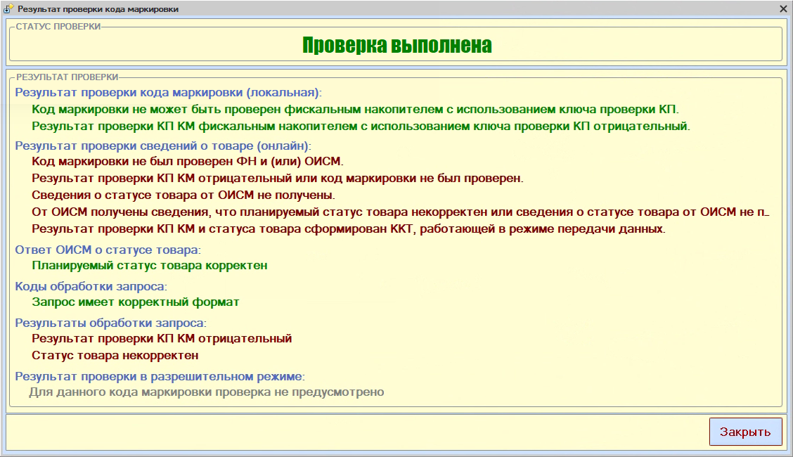

# Не проходит проверка кода маркировки

<table><tr><td><b>Создано:</b> 24.09.2026</td></tr></table>

## Проблема

При продаже маркированного товара коды маркировки перестали проходить проверку, хотя раньше проверка проходила без ошибок. В окне «Результат проверки кода маркировки» программа сообщает, что сведения о статусе товара от ОИСМ не получены, а результат проверки отрицательный:

## Причина

Сбой или технические работы на серверах «Честного знака» (ОИСМ – оператор информационной системы мониторинга). Код маркировки проверяется онлайн, и пока сервер «Честного знака» недоступен, проверка не проходит.

## Решение

1. Повторите проверку позже. После восстановления работы серверов «Честного знака» коды снова проверяются без ошибок, дополнительных настроек в программе не требуется.
2. Если проверка не проходит продолжительное время, проверьте подключение к интернету, связь с ОФД и настройки сканера – см. «[Операции с кодами маркировки → Пробитие чека с маркированными товарами](../../../../articles/5S%20AUTO/Маркировка/Операции%20с%20кодами%20маркировки/operacii-s-kodami-markirovki.md#пробитие-чека-с-маркированными-товарами)», – и обратитесь в техподдержку.

## Материалы для изучения

- «[Операции с кодами маркировки](../../../../articles/5S%20AUTO/Маркировка/Операции%20с%20кодами%20маркировки/operacii-s-kodami-markirovki.md)» – проверка кодов маркировки на ККТ и результаты проверки [М+], [М], [М-].

## Похожие вопросы

- Не проходит проверка кода маркировки
- Перестали проверяться коды маркировки, выдает ошибку
- ЧЗ ошибка проверки
- Сведения о статусе товара от ОИСМ не получены
- Результат проверки КП КМ отрицательный
- Статус товара некорректен

## Теги

маркировка, код маркировки, проверка кода маркировки, Честный знак, ОИСМ, ККТ, чек, сбой
