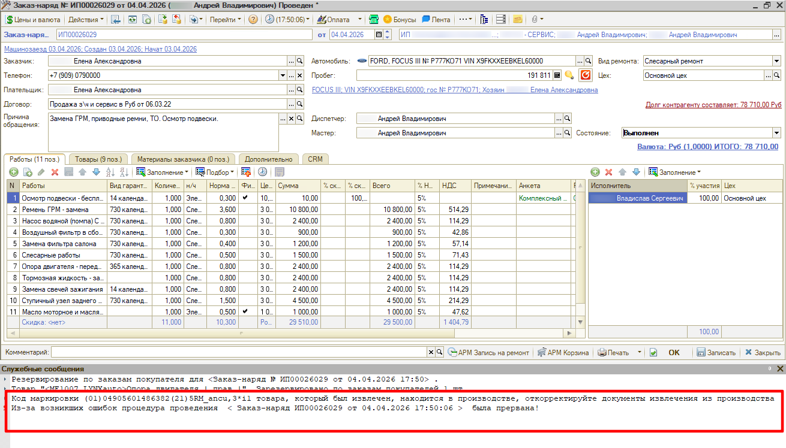
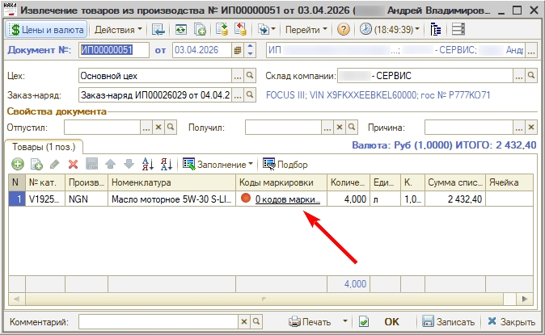

# Что делать, если заказ-наряд не переводится в статус «Выполнен»

## Проблема

При переводе заказ-наряда в состояние «Выполнен» проведение прерывается, а в служебных сообщениях выходит ошибка:

> Код маркировки (01)…(21)… товара, который был извлечен, находится в производстве, откорректируйте документы извлечения из производства  
> Из-за возникших ошибок процедура проведения < Заказ-наряд ИП00026029 от 04.04.2026 17:50:06 > была прервана!

## Причина

Товар с маркировкой был перемещен в заказ-наряд, то есть передан в производство. Затем по нему создан документ **«Извлечение товаров из производства»**, но коды маркировки в нем не извлечены — в колонке «Коды маркировки» стоит «0 кодов маркировки».

## Решение

Откройте документ извлечения товаров из производства по этому заказ-наряду и отсканируйте коды маркировки в строке товара. После этого проведите документ и повторите перевод заказ-наряда в статус «Выполнен».
