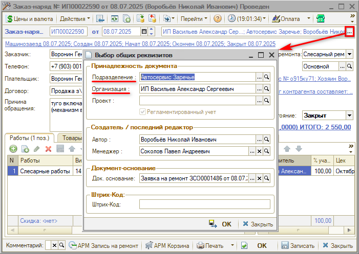
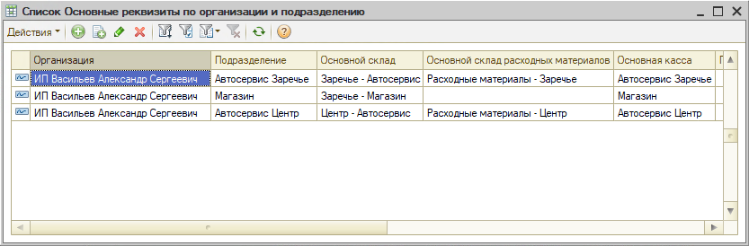

# Как настроить права для компании с несколькими подразделениями

<table><tr><td><b>Обновлено:</b> 16.06.2022</td></tr></table>

Источник: https://www.5systems.ru/help/osobennosti-nastroyki-dlya-kompaniy-s-neskolkimi-podrazdeleniyami

## Вопрос

Какие права и настройки нужны компании с несколькими подразделениями?

## Ответ

### Содержание

1. [Введение](#введение)
2. [Описание прав и настроек для компаний с несколькими подразделениями](#описание-прав-и-настроек-для-компаний-с-несколькими-подразделениями)

### Введение

В данной статье рассматриваются права и настройки, которые используются в случае необходимости *задать ограничения на использование договоров другого подразделения*.

Данный функционал отчасти связан с механизмом [*RLS*](../../../../articles/5S%20AUTO/Администрирование%20и%20настройка%20системы/Доступ%20к%20данным%20по%20подразделениям%20%28RLS%29/dostup-k-dannym-po-podrazdeleniyam-rls.md). Функция RLS разграничивает видимость документов и отчетов отдельным пользователям по подразделениям. Если этот механизм не включать, можно также использовать ряд прав и настроек, которые ограничивают права только текущим подразделением, в котором работает пользователь.

### Описание прав и настроек для компаний с несколькими подразделениями

Все рассматриваемые права [*настраиваются*](../../../../articles/5S%20AUTO/Пользователи%20и%20права/Установка%20прав%20и%20настроек%20пользователя/ustanovka-prav-i-nastroek-polzovatelya.md) на конкретного пользователя (назначение «Пользователь»).

<table><tr><th>Наименование права / настройки</th><th>Путь + Описание</th><th>Комментарий</th></tr><tr><td><b>Фильтрация справочников и документов</b></td><td>СПРАВОЧНИКИ → ✓ Позволяет при открытии форм списков справочников (для выбора), документов и журналов фильтровать их по организации и/или подразделению.</td><td>Документы и некоторые справочники у сотрудников, которым назначено данное право, будут открываться с отбором по подразделениям либо организациям.</td></tr><tr><td><b>Разрешать отключать фильтрацию справочников и документов</b></td><td>ПЯТЬ СИСТЕМ → АВТОСЕРВИС → ✓ При установленном праве в значении Истина пользователь имеет возможность отключить отборы по организации и подразделению.</td><td>Связанное с предыдущим право. Если не включено, то пользователю (рядовому сотруднику) нельзя будет снять отбор, то есть он будет видеть только документы своего подразделения.</td></tr><tr><td colspan="3">Эти два права позволяют фильтровать документы в списках документов, но не в отчетах – неполное ограничение (в отличие от более полного разграничения при использовании механизма <a href="../../../../articles/5S%20AUTO/Администрирование%20и%20настройка%20системы/Доступ%20к%20данным%20по%20подразделениям%20%28RLS%29/dostup-k-dannym-po-podrazdeleniyam-rls.md"><i>RLS</i></a>), т.е. если сформировать отчет – в нем будут отображаться все данные.</td></tr><tr><td colspan="3">Также существует ряд прав, которые позволяют установить ограничение на использование договоров и складов других подразделений:</td></tr><tr><td><b>Контролировать соответствие организации и подразделения</b></td><td>ДОКУМЕНТЫ → ОБЩИЕ ПАРАМЕТРЫ ДОКУМЕНТОВ → ВВОД НОВЫХ ДОКУМЕНТОВ → ✓ Включает / отключает предупреждение при несоответствии организации и подразделения в документе. Для текущего пользователя это право/настройка берется из подразделения &lt;наименование подразделения&gt;.</td><td>В документе указывается принадлежность документа по организации и подразделению. Данное право означает, что подразделение в документе должно относиться к организации (выбрать другое подразделение будет невозможно).   &nbsp;&nbsp;&nbsp;&nbsp;&nbsp;&nbsp;&nbsp;&nbsp;&nbsp;&nbsp;&nbsp;&nbsp;&nbsp;&nbsp;&nbsp;&nbsp;&nbsp;&nbsp;&nbsp;&nbsp;&nbsp;&nbsp;&nbsp;&nbsp;&nbsp;&nbsp;&nbsp;&nbsp;&nbsp;&nbsp;&nbsp;&nbsp;&nbsp;&nbsp;&nbsp;&nbsp;&nbsp;&nbsp;&nbsp;&nbsp;&nbsp;&nbsp;&nbsp;&nbsp;&nbsp;&nbsp;&nbsp;&nbsp;&nbsp;&nbsp;&nbsp;&nbsp;&nbsp;&nbsp;&nbsp;&nbsp;&nbsp;&nbsp;&nbsp;&nbsp;&nbsp;&nbsp;&nbsp;&nbsp;&nbsp;&nbsp;&nbsp;&nbsp;&nbsp;&nbsp;&nbsp;&nbsp;&nbsp;&nbsp;&nbsp;&nbsp;&nbsp;&nbsp;&nbsp;&nbsp;&nbsp;&nbsp;&nbsp;&nbsp;&nbsp;&nbsp;&nbsp;&nbsp;&nbsp;&nbsp;&nbsp;&nbsp;&nbsp;&nbsp;&nbsp;&nbsp;&nbsp;&nbsp;&nbsp;&nbsp;&nbsp;&nbsp;&nbsp;&nbsp;&nbsp;&nbsp;&nbsp;&nbsp;&nbsp;&nbsp;&nbsp;&nbsp;&nbsp;&nbsp;&nbsp;&nbsp;&nbsp;&nbsp;&nbsp;&nbsp;&nbsp;&nbsp;&nbsp;&nbsp;&nbsp;&nbsp;&nbsp;&nbsp;&nbsp;&nbsp;&nbsp;&nbsp;&nbsp;&nbsp;&nbsp;&nbsp;&nbsp;&nbsp;&nbsp;&nbsp;&nbsp;&nbsp;&nbsp;&nbsp;&nbsp;&nbsp;&nbsp;&nbsp;&nbsp;&nbsp;&nbsp;&nbsp;&nbsp;&nbsp;&nbsp;&nbsp;</td></tr><tr><td><b>Контроль корректности договора и склада документа</b></td><td>ДОКУМЕНТЫ → ОБЩИЕ ПАРАМЕТРЫ ДОКУМЕНТОВ → ВВОД НОВЫХ ДОКУМЕНТОВ → ✓ Способ контроля соответствия подразделения и организации документа подразделению и организации договора или склада документа. Например, если контроль ведется по организации, то в документе не допускается выбирать договор (или склад), организация которого отличается от организации шапки документа. Для текущего пользователя это право/настройка берется из подразделения &lt;наименование подразделения&gt;.</td><td>Организация и подразделение договора/склада должны соответствовать организации и подразделению документа.</td></tr><tr><td colspan="3">Последнее право не всегда удобно использовать: если склад должен быть общий, но при этом договора нужно контролировать по каждому подразделению/организации, тогда вместо данного права используются следующие настройки:</td></tr><tr><td><b>Контроль корректности склада в документе</b></td><td>ПЯТЬ СИСТЕМ → АВТОСЕРВИС → ✓</td><td>Будет контролироваться только склад.</td></tr><tr><td><b>Контроль корректности договора взаиморасчетов в документе</b></td><td>ПЯТЬ СИСТЕМ → АВТОСЕРВИС → ✓</td><td>Будет контролироваться только договор.</td></tr><tr><td colspan="3">В случае если подразделения не привязаны к организациям, но склады привязаны, может использоваться дополнительная настройка, которая определяет, какой склад в документе может быть:</td></tr><tr><td><b>Основной склад компании</b></td><td>ДОКУМЕНТЫ → ОБЩИЕ ПАРАМЕТРЫ ДОКУМЕНТОВ → ТОВАРНЫЕ ДОКУМЕНТЫ → ✓ В этой настройке пользователь может установить значение склада по умолчанию, которое будет использоваться для заполнения соответствующего поля в новых документах.</td><td>Право назначается, если пользователь может оформлять документы с разных организаций. Добавлен механизм в настройке – регистр сведений «Основные реквизиты по организации и подразделению»:   С помощью этого регистра можно заполнить соответствие склада конкретным подразделению и организации. Помимо Основного склада можно настроить Основной склад расходных материалов и Основную кассу. Если настроить этот регистр, тогда в документы вместо основного склада компании будет подтягиваться склад из этой настройки.</td></tr><tr><td><b>Основная касса</b></td><td>ДОКУМЕНТЫ → ОБЩИЕ ПАРАМЕТРЫ ДОКУМЕНТОВ → ВЗАИМОРАСЧЕТЫ И ДЕНЕЖНЫЕ СРЕДСТВА → ✓ Эта настройка пользователя содержит значение по умолчанию для заполнения поля «Касса компании» при создании новых объектов (документов, элементов справочников).</td><td>Назначается также по пользователю (поэтому, если много подразделений, использовать это право бывает неудобно).</td></tr><tr><td><b>Основной склад для комплектации расходных материалов</b></td><td>ПЯТЬ СИСТЕМ → АВТОСЕРВИС → ✓</td><td>Можно задать, чтобы расходные материалы комплектовались на отдельном складе. Если здесь не задано значение, то используется основной склад.</td></tr></table>

## См. также

- [Как ограничить редактирование документов](../Как%20ограничить%20редактирование%20документов/kak-ogranichit-redaktirovanie-dokumentov.md)
- [Не получается выбрать показатели в настройках отчета](../../CRM/Не%20получается%20выбрать%20показатели%20в%20настройках%20отчета/ne-poluchaetsya-vybrat-pokazateli-v-nastroykah-otcheta.md)
- [Не получается провести документ (нет доступа к складу)](../../Склад%20и%20запчасти/Не%20получается%20провести%20документ%20%28нет%20доступа%20к%20складу%29/ne-poluchaetsya-provesti-dokument-net-dostupa-k-skladu.md)
- [Как задать склад по умолчанию для организации](../../Склад%20и%20запчасти/Как%20задать%20склад%20по%20умолчанию%20для%20организации/kak-zadat-sklad-po-umolchaniyu.md)

## Похожие вопросы

> *Комментарий: «Похожие вопросы» составлены при переносе из статей в советы (16.09.2026), формулировок из тикетов нет — проверить.*

- Как настроить права для компании с несколькими подразделениями
- Как сделать настройки для компании с несколькими подразделениями
- Как настроить программу для компании с несколькими подразделениями
- Особенности настройки для компаний с несколькими подразделениями
- Как ограничить пользователя работой только со своим подразделением
- Как настроить видимость документов по подразделениям
- Какие права отвечают за фильтрацию справочников и документов по подразделению

## Теги

практики, подразделения, права доступа, rls, настройка
