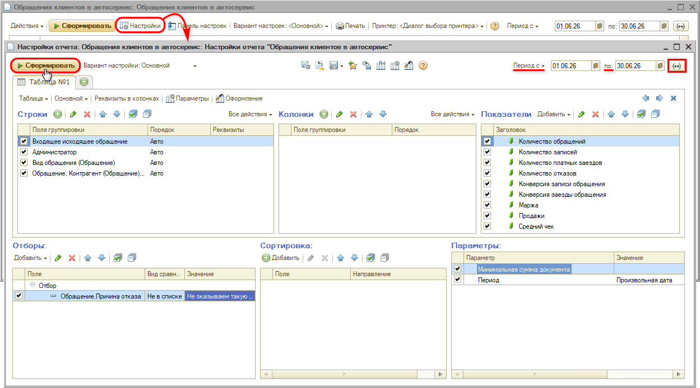

# Как посмотреть статистику обращений клиентов в автосервис

<table><tr><td><b>Создано:</b> 16.09.2026</td></tr></table>

## Вопрос

Как узнать, сколько клиентов обратилось в автосервис за период, сколько из них записалось и приехало?

## Ответ

Для этого предназначен отчет ***«Обращения клиентов в автосервис»***: *CRM → Все операции → Отчеты → Обращения клиентов в автосервис*. Отчет строится по [сделкам](../../../../articles/5S%20AUTO/CRM/Работа%20со%20сделкой/rabota-so-sdelkoy.md) на основании даты изменения этапа сделки и показывает воронку продаж: обращение → запись → заезд → продажи.

1. В настройках отчета задайте *период*. При необходимости добавьте *отбор по причинам отказа*, чтобы исключить нецелевые обращения (для этого справочник *«Причины отказа»* должен быть заранее заполнен).

   

2. Сформируйте отчет и раскрывайте *уровни группировки строк*:
   - 1 уровень – *входящие* и *исходящие* обращения. Исходящие – это сделки, инициированные сотрудниками компании: приглашения по рекомендациям, на ТО и т. п.
   - 2 уровень – *администраторы*: сотрудник, который последним обслуживал клиента в рамках сделки.
   - 3 уровень – *источники обращений*: телефонный звонок, пропущенный звонок, мобильное приложение 5S LINK, заявка с сайта, визит, чат. Источник определяется автоматически по причине создания сделки.
   - последний уровень – показатели по каждому обращению; из строки можно перейти в сделку и посмотреть в [событиях сделки](../../../../articles/5S%20AUTO/CRM/События%20сделки/sobytiya-sdelki.md) всю историю общения с клиентом.

3. Оцените *показатели*: количество обращений, записей, заездов и отказов, конверсия записи и заезда (в %), маржа, продажи, средний чек.

   

Так отчет показывает, сколько поступило целевых обращений, сколько из них завершилось записью и реальным заездом и на какую сумму выполнены работы и проданы товары по каждому заезду. Его же используют для анализа отказов и для мотивации операторов и call-центра по числу заездов.

*Примечание:* в [режиме работы CRM](../../../../articles/5S%20AUTO/CRM/Режимы%20работы%20CRM/rezhimy-raboty-crm.md) «лиды + сделки» нецелевые обращения отсеиваются еще на этапе лида и в отчет не попадают; в простом режиме (без лидов) их нужно закрывать с указанием причины отказа и исключать отбором.

## См. также

- [Как посмотреть количество уникальных клиентов, обратившихся за период](../../CRM/Как%20посмотреть%20количество%20уникальных%20клиентов,%20обратившихся%20за%20период/kak-posmotret-kolichestvo-unikalnyh-klientov.md)
- [Не получается выбрать показатели в настройках отчета](../../CRM/Не%20получается%20выбрать%20показатели%20в%20настройках%20отчета/ne-poluchaetsya-vybrat-pokazateli-v-nastroykah-otcheta.md)

## Материалы для изучения

- «[Отчет «Обращения клиентов в автосервис»](../../../../articles/5S%20AUTO/Отчеты/Отчет%20Обращение%20клиентов%20в%20автосервис/ARTICLE.md)» — основная статья: подробное описание показателей, уровней группировки, источников обращений и отбора по причинам отказа.
- «[Режимы работы CRM](../../../../articles/5S%20AUTO/CRM/Режимы%20работы%20CRM/rezhimy-raboty-crm.md)» — чем отличается работа с лидами от простого режима.
- «[События сделки](../../../../articles/5S%20AUTO/CRM/События%20сделки/sobytiya-sdelki.md)» — история общения с клиентом по сделке.

## Похожие вопросы

- Как посмотреть статистику обращений клиентов в автосервис
- Как посчитать конверсию обращений в записи и заезды
- Как узнать, откуда приходят клиенты
- Как посмотреть, сколько клиентов записал каждый администратор
- Как исключить нецелевые обращения из отчета

## Теги

отчеты, CRM, обращения клиентов, воронка продаж, конверсия, заезды, источники обращений, причины отказа
