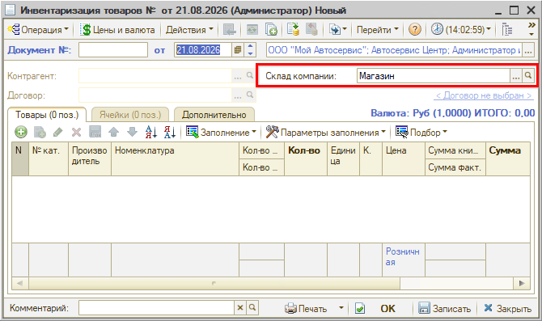
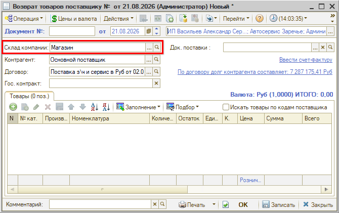
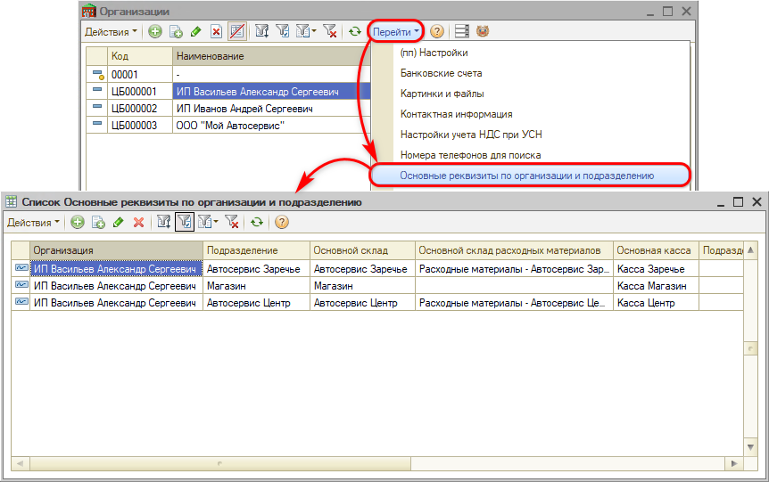
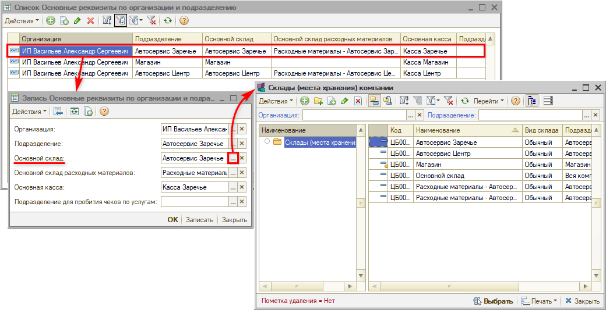

# Как задать склад по умолчанию для организации

## Вопрос

При создании [инвентаризации](https://www.5systems.ru/help/inventarizaciya) по одной организации в поле **«Склад компании»** подставляется определенный склад:

Он же встает по умолчанию и в возврате товаров поставщику по другой организации, хотя там нужен другой склад:

Можно ли настроить свой склад по умолчанию для каждой организации?

## Ответ

Да, для этого есть механизм установки основных реквизитов по организации и подразделению. В специальном регистре для каждой пары «[организация](https://www.5systems.ru/help/spravochnik-organizacii) + [подразделение](https://www.5systems.ru/help/spravochnik-podrazdeleniya-kompanii)» задается свой основной склад — он и подставляется в новые документы.

1. Откройте справочник **«Организации»**: *Администрирование → Компания → Структура компании → Организации*.
2. Выделите строку с нужной организацией и выберите **«Перейти» → «Основные реквизиты по организации и подразделению»**.

3. Откройте запись с нужным подразделением (или создайте новую).
4. В реквизите **«Основной склад»** выберите нужный склад и нажмите **«ОК»** или **«Записать»**.

После этого в новых документах по этой организации и подразделению подставляется заданный склад.

*Примечание:* кроме основного склада, в записи задаются склад расходных материалов, касса, а также подразделение для пробития чеков по услугам. Реквизиты задаются для каждой пары «организация — подразделение» отдельной записью, поэтому настройку нужно повторить по всем подразделениям, где они должны отличаться.

## Материалы для изучения

- «[Справочник «Организации»](https://www.5systems.ru/help/spravochnik-organizacii)» — карточка организации и ее реквизиты.
- «[Справочник «Подразделения компании»](https://www.5systems.ru/help/spravochnik-podrazdeleniya-kompanii)» — структура подразделений.
- «[Инвентаризация](https://www.5systems.ru/help/inventarizaciya)» — оформление инвентаризации товаров.

## Похожие вопросы

- Как задать склад по умолчанию для организации
- В документах подставляется не тот склад
- Можно ли задать свой склад для каждой организации
- Где настроить основной склад подразделения
- Почему в инвентаризации всегда один и тот же склад

## Теги

склад, склад по умолчанию, основной склад, организация, подразделение, основные реквизиты, инвентаризация, возврат поставщику, основная касса
