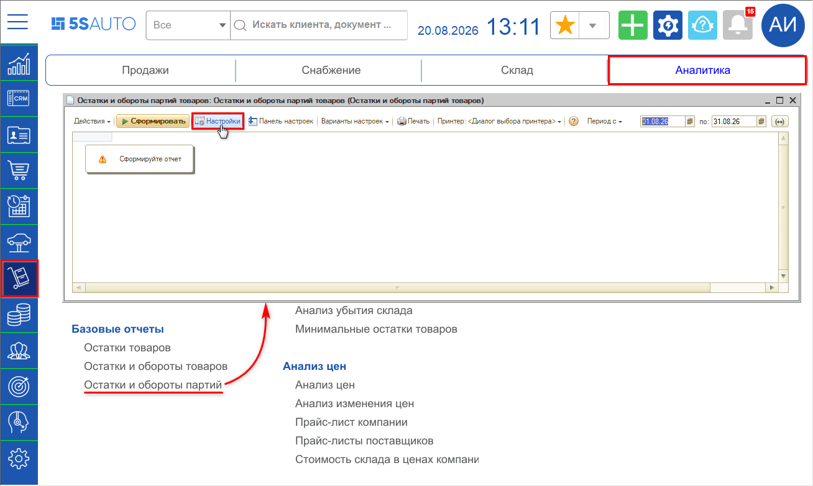
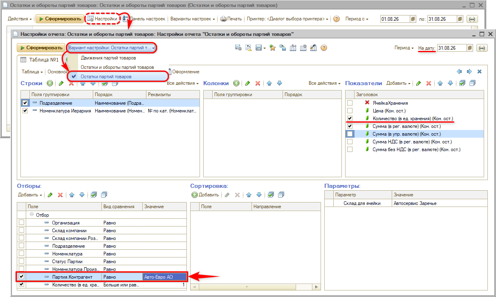
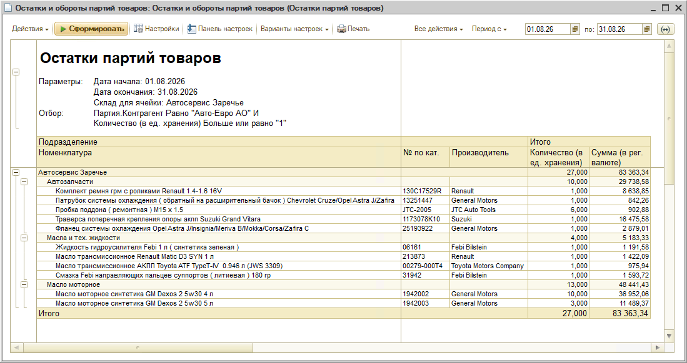

# Как посмотреть остатки товара по поставщику

Используйте отчет **«Остатки и обороты партий товаров»** с отбором по поставщику.

## Как сформировать отчет

1. Откройте отчет: **Запчасти и склад → Аналитика → Базовые отчеты → Остатки и обороты партий**.
2. Перейдите в окно настроек нажатием кнопки **«Настройки»**.

3. Выберите **вариант настройки** — **«Остатки партий товаров»**.
4. Дату можно не задавать — по умолчанию подставляется последний день текущего месяца.
5. В блоке **«Показатели»** оставьте отмеченным **«Количество (в ед. хранения) (Кон. ост.)»** (остальные показатели на свое усмотрение).
6. В блоке **«Отборы»** добавьте строку с полем **«Партия.Контрагент»**, вид сравнения **«Равно»**, а в значении выберите нужного поставщика.
7. Нажмите **«Сформировать»**.

## Что покажет отчет

Отчет выведет остатки только по тем партиям, которые поступили от выбранного поставщика: по каждой позиции номенклатуры — количество в единицах хранения с итогами по группам и подразделениям.

В примере отобраны остатки по поставщику «Авто-Евро АО» — 27 единиц на 83 363,34 руб.

При необходимости можно изменить группировку строк, добавить показатели (цену, суммы НДС) и использовать другие отборы — например, по складу или подразделению.

---

**Теги:** остатки, партии товаров, поставщик, контрагент, отчеты, аналитика, отбор, склад
