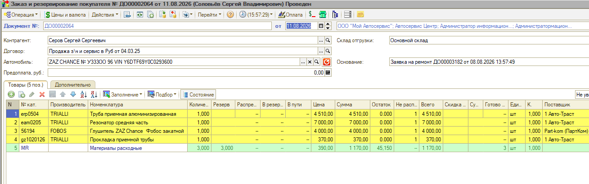
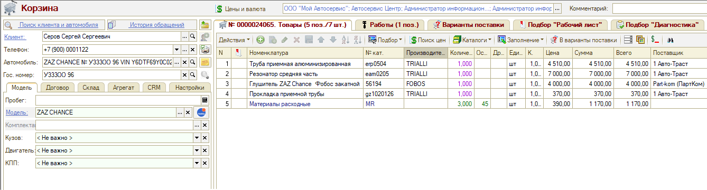
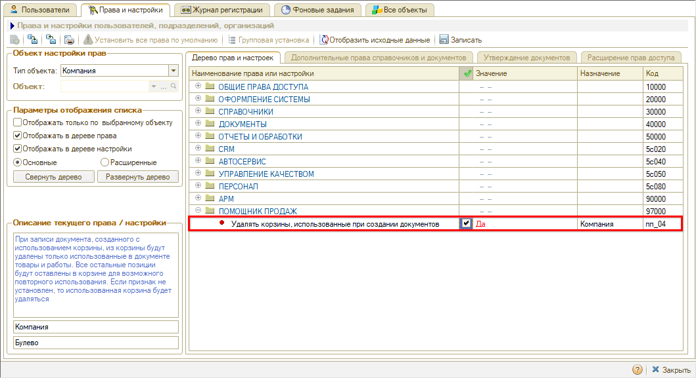

# Корзина не очищается после создания документа

**Обновлено:** 24.08.2026

## Проблема

Из [Корзины](https://www.5systems.ru/help/rabota-v-arm-korzina) запчасти и работы перенесены в заказ покупателя или заказ-наряд, документ создан:

Но в самой Корзине все детали и работы остались — раньше после переноса она становилась пустой:

## Причина

За очистку Корзины отвечает право **«Удалять корзины, использованные при создании документов»** (код `пп_04`). Если право стоит в значении **«Нет»**, Корзина после создания документа не удаляется.

## Решение

Если Корзина должна удаляться при использовании, переведите право в значение **«Да»**:

1. Откройте *Администрирование → Сервис → Пользователи и права → Установка прав и настроек* (или нажмите **«Права и настройки»** в справочнике пользователей).
2. В блоке **«Объект настройки прав»** выберите тип объекта **«Компания»**.
3. В дереве прав найдите право **«Удалять корзины, использованные при создании документов»** (раздел **«ПОМОЩНИК ПРОДАЖ»**).
4. В колонке **«Значение»** установите **«Да»**.
5. Нажмите **«Записать»**.

*Примечание:* из программы Корзина при этом не удаляется — она помечается на удаление, чтобы сохранялась ссылочная целостность.

Подробнее о настройке прав см. в статье «[Установка прав и настроек пользователя](https://www.5systems.ru/help/ustanovka-prav-i-nastroek-polzovatelya)».

## Материалы для изучения

- «[Работа в АРМ «Корзина»](https://www.5systems.ru/help/rabota-v-arm-korzina)» — подбор запчастей и работ и создание документов из Корзины.
- «[Установка прав и настроек пользователя](https://www.5systems.ru/help/ustanovka-prav-i-nastroek-polzovatelya)» — форма прав, типы объектов настройки и дерево прав.

## Похожие вопросы

- Корзина не очищается после создания документа
- Вопрос по корзине заказчика
- При перенесении запчастей из корзины в заказ покупателя или наряд-заказ все детали и работы остаются в корзине. Раньше после перенесения корзина становилась пустой

## Теги

Корзина, АРМ Корзина, помощник продаж, заказ покупателя, заказ-наряд, не очищается, права, установка прав и настроек
