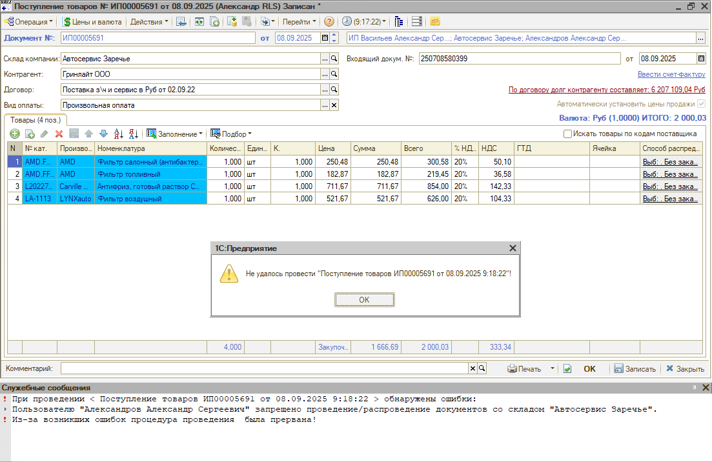
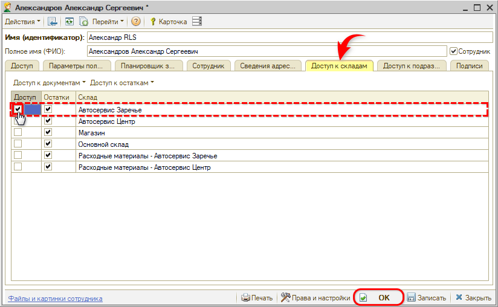

# Не получается провести документ (нет доступа к складу)

## Проблема

При попытке провести документ (или внести изменения в уже проведенный документ) у пользователя выходит служебное сообщение о запрете проведения документов с текущим складом:

> При проведении <наименование документа> обнаружены ошибки:  
> Пользователю "<имя пользователя>" запрещено проведение/распределение документов со складом "<наименование склада>".

Провести документ не удается.

## Причина

Для текущего пользователя настроено [ограничение видимости складов](https://www.5systems.ru/help/nastroyka-vidimosti-skladov): у него нет доступа к проведению документов по тому складу, который указан в документе.

## Решение

Если этому пользователю нужно разрешить проведение документов по данному складу, то пользователь с правами администратора должен сделать следующие настройки:

1. Откройте карточку пользователя и перейдите на вкладку **«Доступ к складам»**.
2. В колонке **«Доступ»** поставьте галочку в строке с нужным складом.
3. Нажмите **«ОК»** или **«Записать»**.
4. Попросите пользователя перезайти в программу — после этого документ проводится.

Колонка **«Доступ»** отвечает за редактирование документов по складу, колонка **«Остатки»** — за просмотр остатков по нему. Без галочки в колонке «Доступ» пользователь может просматривать, создавать и сохранять непроведенные документы по недоступному складу, но не сможет проводить их.

## Материалы для изучения

Подробнее, как настраивается видимость складов для пользователей, см. в статье «[Настройка видимости складов](https://www.5systems.ru/help/nastroyka-vidimosti-skladov)».

---

**Теги:** склад, доступ к складам, видимость складов, права пользователя, не проводится документ, запрет проведения, служебные сообщения
