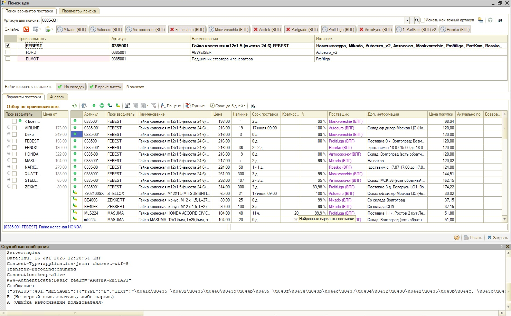
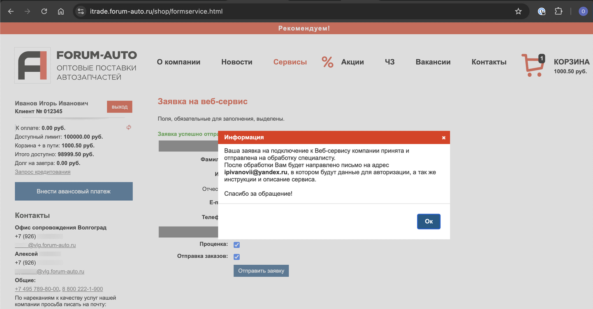

# Не работает проценка по отдельному поставщику

<table><tr><td><b>Создано:</b> 16.09.2026</td></tr></table>

## Проблема

При проценке по поставщикам (в [Поиске цен](../../../../articles/5S%20AUTO/Проценка%20запчастей%20и%20работ/Поиск%20цен/poisk-cen.md) или [Корзине](../../../../articles/5S%20AUTO/Проценка%20запчастей%20и%20работ/Работа%20в%20АРМ%20Корзина/rabota-v-arm-korzina.md)) предложения от одного из поставщиков не приходят, по остальным поставщикам проценка работает. В служебных сообщениях выводится ответ Веб-сервиса поставщика с ошибкой авторизации пользователя: «Неверный пользователь, либо пароль»:

Другой вариант той же проблемы: у отдельного поставщика не работает проценка по конкретному артикулу — ошибок нет, но предложений по нему от этого поставщика тоже нет.

## Причина

- Неверные логин или пароль в настройках подключения к Веб-сервису поставщика. Программа обращается к сервису с учетными данными, указанными в карточке [Веб прайс-листа](../../../../articles/5S%20AUTO/Склад%20и%20запчасти/Создание%20и%20настройка%20Веб%20прайс-листа/sozdanie-i-nastroyka-veb-prays-lista.md#создание-веб-прайс-листа) поставщика на вкладке **«Параметры сервиса»**. Это логин и пароль, с которыми была регистрация в личном кабинете на сайте поставщика: если их изменили на сайте, ввели с ошибкой или указали данные другого аккаунта, поставщик отвечает ошибкой авторизации.
- Учетные данные указаны верно, но в системе самого поставщика они не работают: доступ к API для вашей компании не открыт, логин временно заблокирован или клиент с такой комбинацией логина и пароля не найден.
- Такого артикула нет в прайс-листе этого поставщика — тогда ошибок нет, но и предложений по артикулу от него не будет.

## Решение

1. Проверьте логин и пароль в настройках подключения: откройте Веб прайс-лист этого поставщика и на вкладке **«Параметры сервиса»** сверьте их с теми, с которыми вы регистрировались в личном кабинете на сайте поставщика. У некоторых поставщиков вместо пароля используется ключ API — параметры подключения для каждого Веб-сервиса описаны в разделе «[Перечень доступных Веб-сервисов поставщиков](../../../../articles/5S%20AUTO/Склад%20и%20запчасти/Создание%20и%20настройка%20Веб%20прайс-листа/sozdanie-i-nastroyka-veb-prays-lista.md#перечень-доступных-веб-сервисов-поставщиков)».
2. Проверьте вход в личный кабинет на сайте поставщика с этими же логином и паролем — ошибка может быть связана с учетными данными в системе самого поставщика.
3. Если не работает проценка по одному артикулу, уточните у поставщика, есть ли такой артикул в его прайс-листе.
4. Если проблема сохраняется, [обратитесь в техподдержку](../../../Техподдержка/Как%20обратиться%20в%20техническую%20поддержку/kak-obratitsya-v-tekhnicheskuyu-podderzhku.md) и пришлите свои данные авторизации у этого поставщика — специалисты проверят подключение.
5. Если после установки логина и пароля выясняется, что логин временно заблокирован или клиент с такой комбинацией логина и пароля не найден в системе поставщика, обратитесь к вашему менеджеру в компании поставщика и уточните:
   - открыт ли доступ к API для вашей компании;
   - какие логин и пароль нужно использовать при работе через API.

   При необходимости отправьте заявку на восстановление доступа и дождитесь ответа поставщика — после восстановления доступа проценка заработает.

   Например, у поставщика [Forum-auto](../../../../articles/5S%20AUTO/Перечень%20доступных%20Веб-сервисов%20поставщиков/Forum-auto%20%28Форум-Авто%29/nastroyka-veb-servisa-forum-auto-forum-avto.md) заявку на подключение к Веб-сервису или восстановление доступа можно отправить из личного кабинета на сайте поставщика: в разделе **«Сервисы» → «Заявка на веб-сервис»** заполните контактные данные, отметьте нужные сервисы («Проценка», «Отправка заказов») и нажмите **«Отправить заявку»**:

   

   После обработки заявки поставщик пришлет на указанный e-mail данные для авторизации, инструкции и описание сервиса:

   

## См. также

- [Как обратиться в техническую поддержку](../../../Техподдержка/Как%20обратиться%20в%20техническую%20поддержку/kak-obratitsya-v-tekhnicheskuyu-podderzhku.md)

## Материалы для изучения

- «[Создание и настройка Веб прайс-листа](../../../../articles/5S%20AUTO/Склад%20и%20запчасти/Создание%20и%20настройка%20Веб%20прайс-листа/sozdanie-i-nastroyka-veb-prays-lista.md)» — настройки подключения к Веб-сервису поставщика и параметры проценки; в конце статьи перечень доступных Веб-сервисов с параметрами подключения для каждого поставщика.
- «[Поиск цен](../../../../articles/5S%20AUTO/Проценка%20запчастей%20и%20работ/Поиск%20цен/poisk-cen.md)» — проценка по артикулу, отбор предложений по поставщику.
- «[Работа в АРМ Корзина](../../../../articles/5S%20AUTO/Проценка%20запчастей%20и%20работ/Работа%20в%20АРМ%20Корзина/rabota-v-arm-korzina.md)» — проценка из Корзины.

## Похожие вопросы

- Не работает проценка по отдельному поставщику
- При работе с проценкой по поставщикам выходит ошибка авторизации пользователя (неверный пользователь или пароль)
- Не работает проценка по артикулу у отдельного поставщика
- Веб-сервис поставщика выдает ошибку «Неверный пользователь или пароль»
- Не приходят предложения от поставщика при проценке

## Теги

проценка, веб-сервис поставщика, Веб прайс-лист, поиск цен, ошибка авторизации, логин и пароль, доступ к API, артикул
