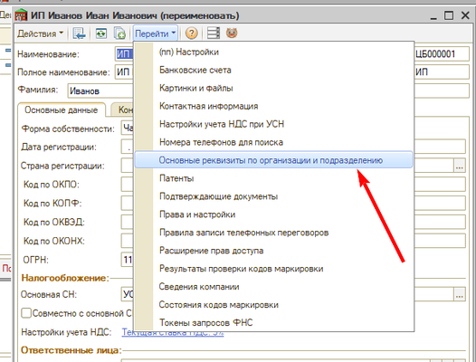

# При загрузке поступления из СБИС подставляется не тот склад

<table><tr><td><b>Создано:</b> 24.09.2026</td></tr></table>

## Проблема

При загрузке документов «Поступление товаров» из СБИС (Saby) в документ подставляется не тот склад, который нужен.

## Причина

В предыдущих релизах программы при загрузке документа из СБИС подставлялся первый найденный склад по подразделению пользователя. Обработку загрузки выполняла компания СБИС.

## Решение

Обновите программу до релиза 5S AUTO … или более нового – в нем склад для загрузки документов берется из настройки.

> *Комментарий: уточнить номер релиза.*

Настройка склада для загрузки документов выполняется в карточке организации: **Перейти → Основные реквизиты по организации и подразделению**.

> *Комментарий: скрин черновой; нужен скрин формы «Основные реквизиты по организации и подразделению» и описание, где указывается склад для загрузки документов.*

## Материалы для изучения

- «[Интеграция с ЭДО → 2. Saby (СБИС)](../../../../articles/5S%20AUTO/Интеграция%20с%20внешними%20сервисами/Интеграция%20с%20ЭДО/integraciya-s-edo.md#2-saby-сбис)» – интеграция 5S AUTO с системой электронного документооборота СБИС.

## Похожие вопросы

- При загрузке поступления из СБИС подставляется не тот склад
- При загрузке документов из СБИС устанавливается неправильный склад
- Как указать склад для загрузки поступления из СБИС
- В поступлении из СБИС склад не тот

## Теги

СБИС, Saby, ЭДО, поступление товаров, загрузка документов, склад, основные реквизиты по организации и подразделению
