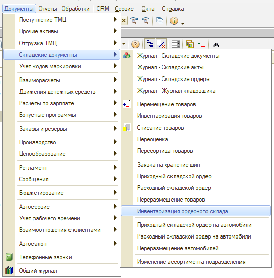
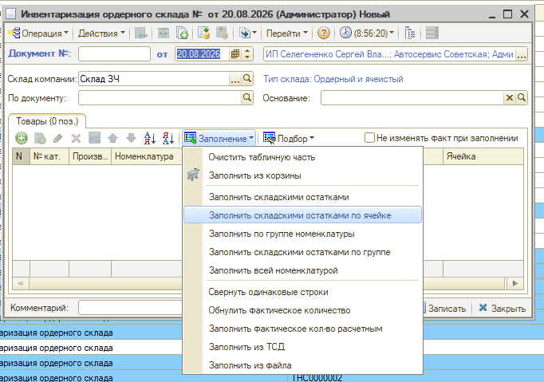
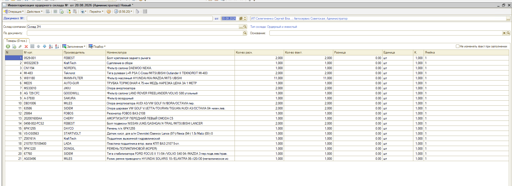

# При заполнении инвентаризации по ячейкам хранения попадают не все товары

<table><tr><td><b>Создано:</b> 25.09.2026</td></tr></table>

## Проблема

В документе «Инвентаризация товаров» указаны ячейки хранения, но при заполнении кнопкой **«Заполнение → Заполнить по ячейкам хранения»** в таблицу попадает всего несколько позиций. Если заполнить документ командой **«Заполнить складскими остатками»**, в таблицу попадают все товары, которые фактически лежат в этих ячейках.

## Причина

Команда «Заполнить по ячейкам хранения» заполняет таблицу товарами, у которых выбранная ячейка указана как **ячейка хранения по умолчанию** в карточке номенклатуры. Товары, у которых ячейка по умолчанию не указана, в документ не попадают, даже если фактически лежат в этой ячейке. Команда «Заполнить складскими остатками» ячейки не проверяет и заполняет таблицу всеми остатками склада.

## Решение

Выберите подходящий вариант:

1. Укажите товарам ячейки хранения по умолчанию – на вкладке **«Ячейки хранения по умолчанию»** в карточке номенклатуры (см. «[Номенклатура → Панель информации](../../../../articles/5S%20AUTO/Склад%20и%20запчасти/Номенклатура/nomenklatura.md#панель-информации)»). После этого команда «Заполнить по ячейкам хранения» будет добавлять эти товары в инвентаризацию.

2. Если нужно заполнить документ фактическими остатками по ячейкам, используйте документ **«Инвентаризация ордерного склада»**:

   1) Откройте документ: **Документы → Складские документы → Инвентаризация ордерного склада**. 
   2) Укажите склад компании. 
   3) Нажмите **«Заполнение → Заполнить складскими остатками по ячейке»** – таблица заполнится остатками товаров с указанием ячеек.

   

   

   

   > *Комментарий: скрины черновые, будут пересняты.*

   *Примечание:* Документ «Инвентаризация ордерного склада» не изменяет количество товаров на складе по остаткам. Для этого введите на его основании документ «Инвентаризация товаров» – см. «[Инвентаризация → Инвентаризация ордерного склада](../../../../articles/5S%20AUTO/Склад%20и%20запчасти/Инвентаризация/inventarizaciya.md#инвентаризация-ордерного-склада)».

## См. также

- «[Пропала вкладка «Остатки по ячейкам» в номенклатуре](../Пропала%20вкладка%20«Остатки%20по%20ячейкам»%20в%20номенклатуре/propala-vkladka-ostatki-po-yacheykam.md)»

## Материалы для изучения

- «[Инвентаризация](../../../../articles/5S%20AUTO/Склад%20и%20запчасти/Инвентаризация/inventarizaciya.md)» – инвентаризация товаров, инвентаризация ордерного склада, инвентаризация по ячейкам хранения.
- «[Как оформить инвентаризацию по ячейкам хранения](../../../../lessons/Урок%205.%20Складской%20учет/Как%20оформить%20инвентаризацию%20по%20ячейкам%20хранения/kak-oformit-inventarizaciyu-po-yacheykam-khraneniya.md)» – урок по заполнению инвентаризации ячейками и товарами.
- «[Виды склада → Ордерно-ячеистый склад](../../../../articles/5S%20AUTO/Склад%20и%20запчасти/Виды%20склада/vidy-sklada.md#ордерно-ячеистый-склад)» – учет остатков по ячейкам хранения.

## Похожие вопросы

- При заполнении инвентаризации по ячейкам хранения попадают не все товары
- При заполнении остатками по ячейкам не подтягивается весь товар
- Инвентаризация по ячейкам хранения заполняется не полностью
- Заполнить по ячейкам хранения – в документ попадает всего несколько позиций
- Как заполнить инвентаризацию остатками по ячейкам

## Теги

инвентаризация, инвентаризация ордерного склада, ячейки хранения, ячейка хранения по умолчанию, номенклатура, складские остатки, ордерно-ячеистый склад
