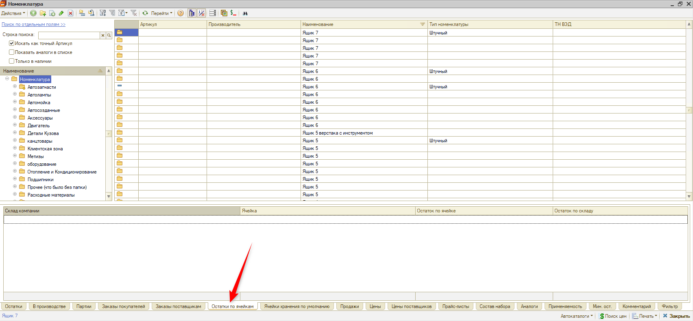
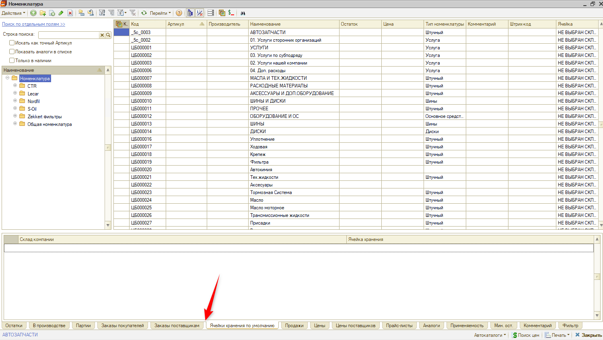
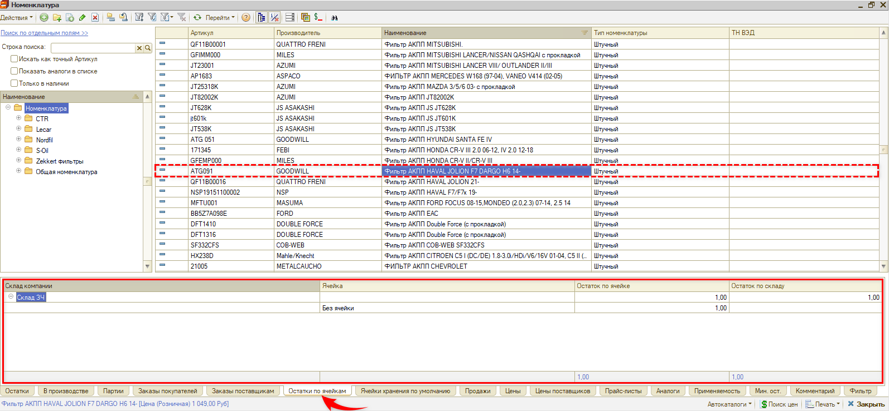

# Пропала вкладка «Остатки по ячейкам» в номенклатуре

<table><tr><td><b>Создано:</b> 17.09.2026</td></tr></table>

## Проблема

После загрузки нового релиза в справочнике «Номенклатура» пропала вкладка панели информации **«Остатки по ячейкам»**, на которой было видно, сколько товара в какой ячейке хранения находится. Можно ли вернуть этот функционал?

Было:

Стало:

## Причина

Начиная с релиза 2.8.4 вкладка «Остатки по ячейкам» по умолчанию не отображается: она выводится только для той номенклатуры, по которой есть остатки в ячейках хранения.

## Решение

Функционал не пропал. Выделите в справочнике «Номенклатура» товар, по которому есть остатки в ячейках хранения, — на панели информации снова появится вкладка **«Остатки по ячейкам»** с остатками по складам и ячейкам:

Если панель информации внизу справочника скрыта, включите ее кнопкой **«Отобразить/скрыть панель информации»** на панели управления (см. статью «Номенклатура» → «[Панель информации](../../../../articles/5S%20AUTO/Склад%20и%20запчасти/Номенклатура/nomenklatura.md#панель-информации)»).

Остатки сразу по всем ячейкам склада можно посмотреть в отчете «[Остатки и обороты ордерного склада](../../../../articles/5S%20AUTO/Отчеты/Отчеты%20по%20складскому%20учету/otchety-po-skladskomu-uchetu.md#2-остатки-и-обороты-ордерного-склада)» (для ордерно-ячеистого склада), а товары обычного склада без назначенных ячеек — в «[Отчете по заполнению ячеек хранения](../../../../articles/5S%20AUTO/Отчеты/Отчеты%20по%20складскому%20учету/otchety-po-skladskomu-uchetu.md#1-отчет-по-заполнению-ячеек-хранения)».

## Материалы для изучения

- «[Номенклатура](../../../../articles/5S%20AUTO/Склад%20и%20запчасти/Номенклатура/nomenklatura.md#панель-информации)» — панель информации справочника и ее вкладки, в том числе «Остатки по ячейкам» и «Ячейки хранения по умолчанию».
- «[Виды склада](../../../../articles/5S%20AUTO/Склад%20и%20запчасти/Виды%20склада/vidy-sklada.md#ордерно-ячеистый-склад)» — ордерно-ячеистый склад и ячеистое хранение: где смотреть остатки по ячейкам.
- «[Отчеты по складскому учету](../../../../articles/5S%20AUTO/Отчеты/Отчеты%20по%20складскому%20учету/otchety-po-skladskomu-uchetu.md)» — отчет по заполнению ячеек хранения, остатки и обороты ордерного склада.

## Похожие вопросы

- Пропала вкладка «Остатки по ячейкам» в номенклатуре
- Пропала вкладка остатки по ячейкам хранения
- Загрузили новый релиз, и в номенклатуре пропала вкладка, где было видно, сколько товаров в какой ячейке хранения находится. Можно вернуть этот функционал?
- В номенклатуре нет вкладки «Остатки по ячейкам»
- Где посмотреть остатки товара по ячейкам хранения

## Теги

номенклатура, панель информации, остатки по ячейкам, ячейки хранения, ячеистое хранение, ордерный склад, обновление релиза
