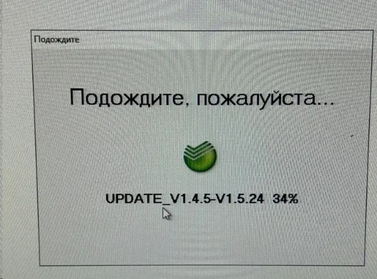
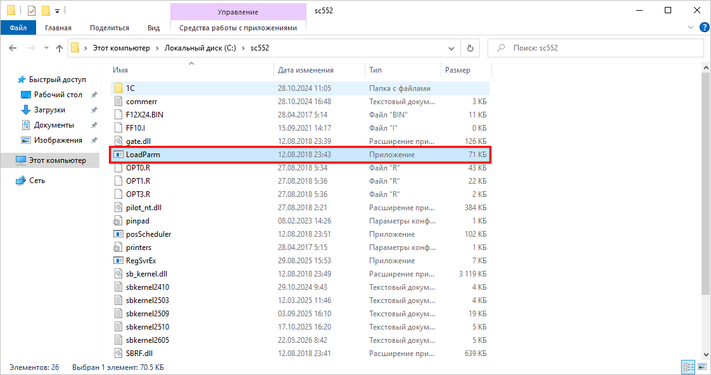

# Ошибка 4001 при закрытии кассовой смены

## Проблема

При закрытии кассовой смены на терминале начинается обновление, но до конца не доходит: программа зависает либо выдает ошибку 4001, после чего 1С аварийно завершает работу. Терминал при этом остается необновленным. Также может выходить подобное окно:

## Причина

Если в обработке закрытия смены выбраны и фискальный регистратор, и эквайринг, программа обращается к оборудованию по очереди. Зависание или подобная ошибка в момент обращения к эквайрингу означает, что на терминале есть неустановленное обновление. Обработка закрытия смены может не запустить это обновление и завершить работу 1С некорректно.

## Решение

Запустите сверку итогов вручную — на том компьютере, к которому подключен эквайринг.

1. Откройте папку `C:\sc552`.
2. Найдите приложение **LoadParm**, нажмите на нем правой кнопкой мыши и выберите «Открыть».

   

3. В открывшемся окне нажмите **«Сверка итогов»**.

Если на терминале есть обновление, сверка итогов его запустит. Дождитесь окончания процедуры — по ее завершении окно закроется. После этого зайдите в 1С и повторите закрытие смены.

## Похожие вопросы

- Ошибка 4001 при закрытии кассовой смены
- Не обновляется терминал, закрывается 1с на середине обновления
- По кассе 4001 ошибка, при Закрытии кассовой смены идет обновление терминала, и выкидывает с 1с
- Проблема с обновлением терминала эквайринга
- Проблема при автоматическом обновлении терминала эквайринга, программа вылетает после продолжительной попытки установки автообновления
- После обновления при попытке принятия оплаты выдает ошибку
- Вылетает программа при закрытии смены

## Теги

эквайринг, терминал, Сбербанк, ошибка 4001, обновление терминала, сверка итогов, LoadParm, sc552, закрытие смены
