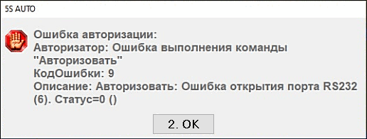

# Ошибка авторизации код 9 / Ошибка терминала эквайринга / Служба "Dual Connector Service" занимает COM-порт

## Проблема

При попытке принять оплату картой выходит ошибка кассы:

> "Ошибка авторизации:  
> Авторизатор: Ошибка выполнения команды "Авторизовать"  
> КодОшибки: 9  
> Описание: Авторизовать: Ошибка открытия порта RS232 (6). Статус=0"

## Решение

Проблема с видимостью терминала эквайринга в VSPE.

Работающая на локальном компьютере служба "Dual Connector Service" занимает COM-порт, что мешает занять этот порт VSPE.

Для решения проблемы необходимо перейти в службы, найти эту службу и отключить её. Также если у данной службы будет включен автозапуск, стоит его отключить: нажать ПКМ по службе → Свойства → Тип запуска → Отключено.

Полное название службы на скриншоте:

**Теги:** эквайринг, терминал, ошибка 9, COM-порт, Dual Connector Service, VSPE, службы Windows, RS232
