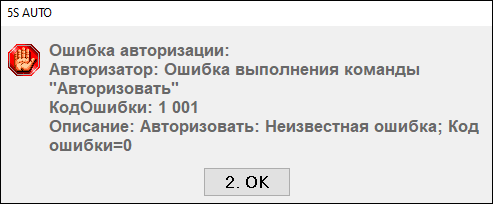

# Ошибка авторизации эквайринга 1001

## Проблема

Не получается принять оплату с типом «Платежная карта»: чек не печатается, потеряна связь с терминалом эквайринга. Терминал при этом может перезагружаться. На компьютере появляется ошибка:

> «Ошибка авторизации:  
> Авторизатор: Ошибка выполнения команды "Авторизовать"  
> КодОшибки: 1 001  
> Описание: Авторизовать: Неизвестная ошибка; Код ошибки=0»

## Решение

Это ошибка от эквайринга: связь с терминалом потеряна. Выполняйте шаги по порядку и после каждого проверяйте работу эквайринга.

### Шаг 1. Перезагрузка

1. Выйдите из программы 1С.
2. Перезагрузите оборудование эквайринга (платежный терминал).
3. Запустите 1С и войдите в систему.
4. Проверьте работу эквайринга.

Иногда процедуру требуется провести дважды с небольшим временным интервалом. Если проблема сохраняется, перейдите к шагу 2.

### Шаг 2. Проверка соответствия COM-порта

На проблему с портом указывает такой признак: без перезагрузки эквайринга и 1С терминал не принимает оплату, и перезагружать его приходится перед каждой оплатой.

**Узнайте порт, указанный в настройках.** Подключитесь к серверу, откройте папку `C:\sc552`, найдите файл `pinpad` и откройте его через Блокнот. В нем есть строка с номером COM-порта, через который настроен эквайринг, — например, `ComPort=4`.

**Определите текущий порт терминала.** Откройте «Диспетчер устройств» — через меню «Пуск» или сочетанием `Win + X` — и разверните раздел «Порты (COM и LPT)». Найдите устройство терминала. Если по названию определить его сложно, отключите питание терминала: устройство исчезнет из списка, а после включения появится вновь, часто с пометкой «новое оборудование».

**Сравните номера.** Если номер порта в файле `pinpad` не совпадает с портом в Диспетчере устройств, выполните переназначение:

1. Щелкните правой кнопкой мыши по устройству терминала → **«Свойства»**.
2. Перейдите на вкладку **«Параметры порта»** → кнопка **«Дополнительно»**.
3. В поле **«Номер порта (COM)»** выберите значение, совпадающее с настройками в файле `pinpad`.
4. Нажмите «ОК» и перезагрузите компьютер.
5. Проверьте работу эквайринга в 1С.

Если номера совпадают, но проблема остается, перейдите к шагу 3.

### Шаг 3. Завершение сеанса пользователя в 1С

Подойдет любой из способов.

**На сервере.** Подключитесь к серверу 1С, нажмите «Пуск», щелкните по имени текущего пользователя и выберите «Выход». Затем войдите заново и запустите 1С.

**Через 1С,** если вы подключаетесь по ярлыку — например, через RemoteApp. В интерфейсе 1С выберите **«Файл» → «Открыть»**, в строке пути напишите `logoff` и нажмите Enter. После завершения сеанса войдите в 1С заново.

**Через Диспетчер задач на сервере** — способ для системного администратора. Откройте Диспетчер задач, на вкладке «Пользователи» найдите нужного пользователя, щелкните по нему правой кнопкой и выберите «Выйти».

Если ни один из шагов не помог, составьте новое обращение в техподдержку.

**Теги:** эквайринг, терминал, Сбербанк, ошибка 1001, авторизовать, COM-порт, pinpad, sc552, платежная карта, завершение сеанса
