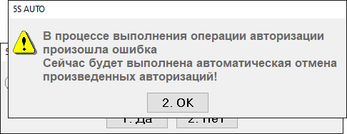

# Ошибка печати квитанции авторизации

## Проблема

После приёма оплаты картой появляется сообщение:

> «Произошла ошибка печати квитанции авторизации  
> Попробовать выполнить печать ещё раз?»

Затем:

> «В процессе выполнения операции авторизации произошла ошибка  
> Сейчас будет выполнена автоматическая отмена произведённых авторизаций!»

Кассовый чек не вышел, у клиента деньги списаны. Прошла ли оплата по кассе в программе — непонятно.

## Решение

Такие ситуации могут возникать при сбоях на стороне терминала эквайринга либо по таймауту при долгом процессе оплаты (более 90 секунд).

1. Необходимо в личном кабинете банка проверить, поступили деньги или нет.
2. Если поступили, то пробить чек без авторизации платежа на терминале.

Если требуется, обратиться в техподдержку за помощью в настройке пользователя.

**Теги:** эквайринг, терминал, квитанция, отмена авторизации, таймаут, деньги списаны, чек без авторизации
