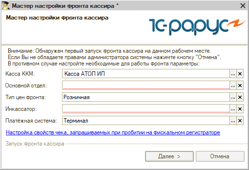

# Касса (фронт кассира) не открывается

**Источник:** https://www.5systems.ru/help/reshenie-rasprostranennykh-oshibok-pri-rabote-s-kassoy

## Проблема

При открытии формы фронта кассира касса не открывается.

## Решение

При открытии данной формы проверьте заполнение всех полей:

- **Касса ККМ** — задаётся в рабочем месте пользователя.
- **Основной отдел** — задаётся в рабочем месте пользователя.
- **Тип цен фронта** — определяется правом «Тип цен, используемый фронтом».
- **Инкассатор** — определяется правами «Основной инкассатор» и «Инкассатор в документах внесения / изъятия».
- **Платёжная система** — определяется правом «Основная платёжная система».
