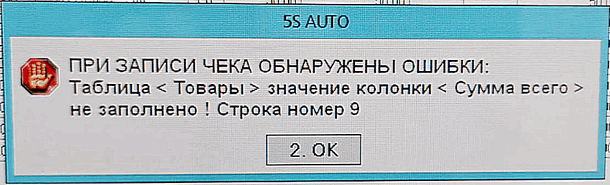

# Нулевая сумма в чеке

**Источник:** https://www.5systems.ru/help/reshenie-rasprostranennykh-oshibok-pri-rabote-s-kassoy

## Проблема

В чеке присутствует строка без 100 % скидки, где сумма «Всего» равна нулю. Сумма «Всего» не может быть равна нулю, кроме случаев, когда это скидка. Касса такие документы не пропускает.

## Решение

Есть право «Не разрешать в чеке строки с 0-й суммой (подарки)», которое частично решает проблему.
