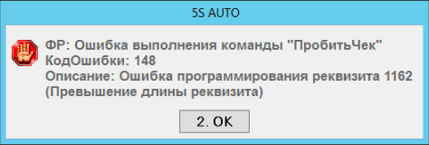

# Ошибка при печати чека с маркировкой

**Источник:** https://www.5systems.ru/help/reshenie-rasprostranennykh-oshibok-pri-rabote-s-kassoy

## Проблема

При печати чека с маркированным товаром выходит ошибка. Причина — длина кода маркировки больше допустимой по количеству символов.

## Решение

Необходимо проверить корректность кода маркировки: его длина не должна превышать допустимое количество символов.
