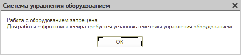
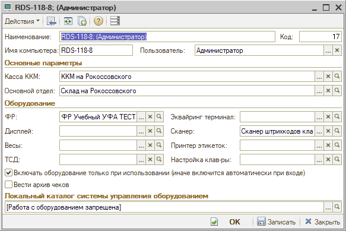
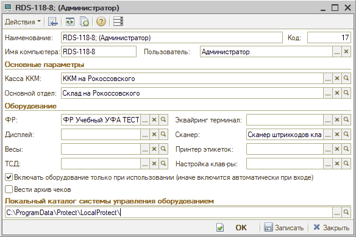

# Работа с оборудованием запрещена

**Источник:** https://www.5systems.ru/help/reshenie-rasprostranennykh-oshibok-pri-rabote-s-kassoy

## Проблема

Ошибка «Работа с оборудованием запрещена» может возникнуть при работе с любым оборудованием. Это значит, что в рабочем месте не указана «рабочая» папка оборудования.



Пример:



## Решение

Для того чтобы оборудование заработало, требуется указать адрес «рабочей папки» в своём рабочем месте:

```
C:\ProgramData\Protect\LocalProtect\
```



После этого перезайти в систему.
