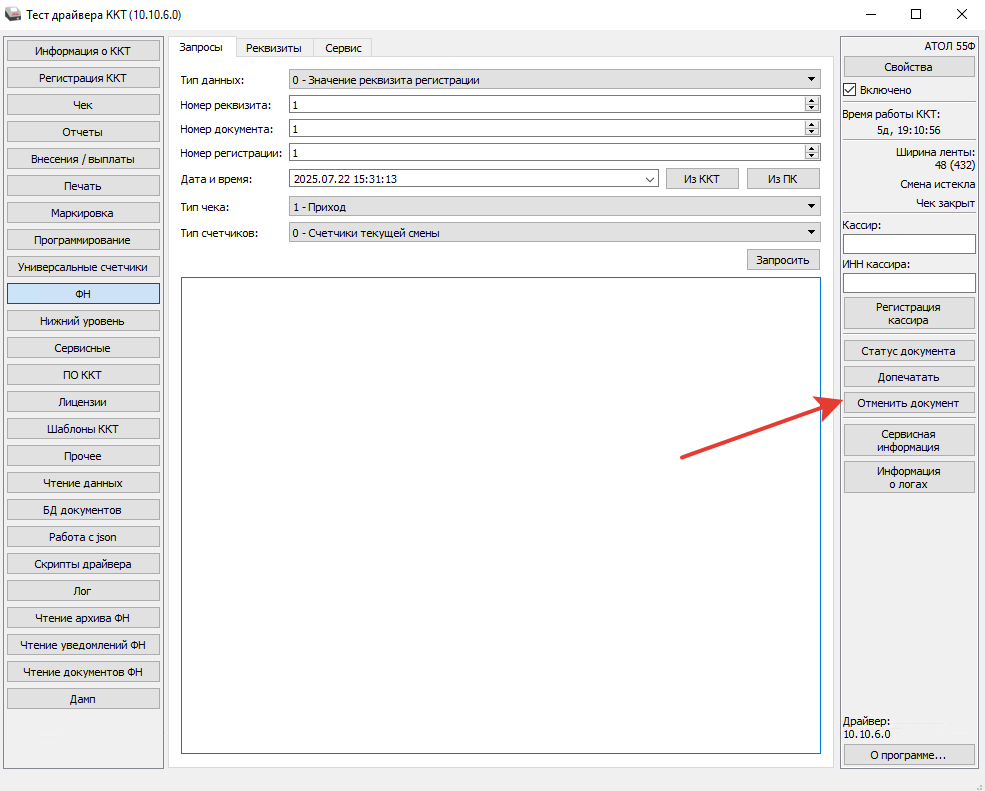

# Закончилась кассовая лента

**Источник:** https://www.5systems.ru/help/reshenie-rasprostranennykh-oshibok-pri-rabote-s-kassoy

## Проблема

Касса заблокировалась: чек не печатается, смена не закрывается.

## Причина

Во время печати чека или закрытия смены закончилась кассовая лента.

## Решение

Замените кассовую ленту, запустите приложение **«Тест драйвера ККТ»** и перейдите в раздел **«ФН»**.

Дальше возможны два варианта:

1. Нажать кнопку **«Допечатать»**.
2. Нажать кнопку **«Отменить документ»**, затем заново распечатать чек.

> **Примечание.** Если ККТ не была применена во время приёма оплаты, необходимо после устранения проблем с кассой пробить чек коррекции — подробнее см. статью «Использование чека коррекции». В случае исправления ошибочно пробитых чеков применение чека коррекции зависит от версии ФФД — подробнее также см. в вышеуказанной статье.

## Похожие вопросы

- Закончилась кассовая лента
- Касса заблокировалась во время печати чека
- Не закрывается смена, в кассе кончилась бумага
- Заменили ленту — как допечатать чек
- Что делать, если чек не допечатался

## Теги

касса, ККМ, кассовая лента, тест драйвера ККТ, допечатать, отменить документ, чек коррекции
