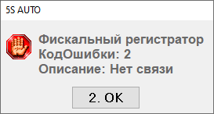

# Касса не включается

**Обновлено:** 24.08.2026

Источник: https://www.5systems.ru/help/reshenie-rasprostranennykh-oshibok-pri-rabote-s-kassoy

## Проблема

При проблемах с подключением кассы программа выдаёт сообщение об ошибке «Нет связи», например:

Следом за ошибкой «Нет связи» выходят ещё две ошибки:

> «Фискальный регистратор не установлен»
>
> «ФР: Ошибка выполнения команды "Получить состояние" <...> Оборудование не найдено»

## Причина

Все приведённые ошибки означают, что касса не работает, не доступна в 1С либо нет связи с кассой.

## Решение

Самое первое, что стоит сделать, — перезапустить кассу и перезайти в 1С.

## См. также

- [Ошибки включения кассы](../Ошибки%20включения%20кассы/oshibki-vklyucheniya-kassy.md)

## Похожие вопросы

- Касса не включается
- Ошибка «Нет связи» с кассой
- Фискальный регистратор не установлен
- Касса не видна в 1С
- Что делать, если пропала связь с ККМ

## Теги

касса, ККМ, нет связи, фискальный регистратор, оборудование не найдено, перезапуск кассы
