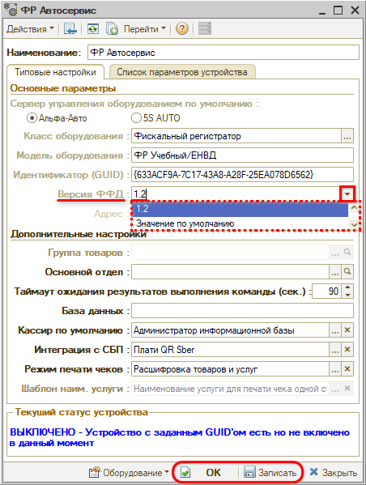

# Некорректные входные параметры при вызове метода оборудования

<table><tr><td><b>Обновлено:</b> 24.08.2026</td></tr></table>

Источник: https://www.5systems.ru/help/reshenie-rasprostranennykh-oshibok-pri-rabote-s-kassoy

## Проблема

При работе с оборудованием выходит ошибка «Некорректные входные параметры при вызове метода оборудования».

## Причина

В карточке оборудования (фискального регистратора) не заполнена версия ФФД.

## Решение

В карточке оборудования (ФР) заполните версию ФФД: выберите значение **«1.2»**, запишите изменения и перезайдите в систему:

## Похожие вопросы

- Некорректные входные параметры при вызове метода оборудования
- Ошибка при вызове метода оборудования на кассе
- Где указать версию ФФД для фискального регистратора
- Касса не пробивает чек после обновления
- Что значит ошибка входных параметров ФР

## Теги

Торговое оборудование, касса, ККМ, фискальный регистратор, ФФД, версия ФФД, карточка оборудования
