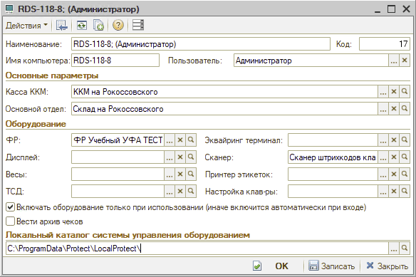

# Оборудование не найдено

<table><tr><td><b>Обновлено:</b> 24.08.2026</td></tr></table>

Источник: https://www.5systems.ru/help/reshenie-rasprostranennykh-oshibok-pri-rabote-s-kassoy

## Проблема

При работе с кассой выходит ошибка «Оборудование не найдено».

## Причина

1. У пользователя в рабочем месте не указан путь до компоненты оборудования в поле «Локальный каталог системы управления оборудованием».
2. При подключении к серверу через удалённый рабочий стол был выполнен вход под этим пользователем, в рабочем месте пользователя каталог указан, но при этом на сервере не установлена компонента оборудования. Такое бывает, когда у пользователя изменился компьютер: на конкретном ПК была установлена компонента, и через установленное на этом ПК «1С Предприятие» пользователь подключался к базе.
3. У пользователя в рабочем месте указан ФР, он включается, но при открытии фронта кассира выходит ошибка — настройки базы и прав подменяют кассу по организации и подразделению документа.

## Решение

Помимо корректной настройки прав необходимо сделать корректную настройку рабочего места данного пользователя.

У нового пользователя может появиться такая ошибка, если ККТ не до конца настроен. Настройка выполняется в разделе: **Справочники → Розница и оборудование → Рабочие места** — добавляем рабочее место по аналогии с уже настроенными:

Более подробное описание доступно по ссылке: https://rarus.ru/press/publications/20190730-metodika-raboty-KKT-v-alfa-avto-avtosalon-avtoservis-avtozapchasti-prof-393386/

## Похожие вопросы

- Оборудование не найдено
- Касса не находится у нового пользователя
- Ошибка оборудования после смены компьютера
- Где указать локальный каталог системы управления оборудованием
- Как настроить рабочее место для работы с ККТ

## Теги

касса, ККМ, оборудование не найдено, рабочее место пользователя, компонента оборудования, локальный каталог, настройка ККТ
