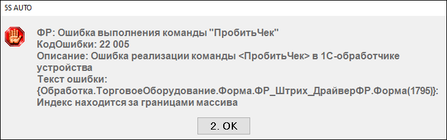
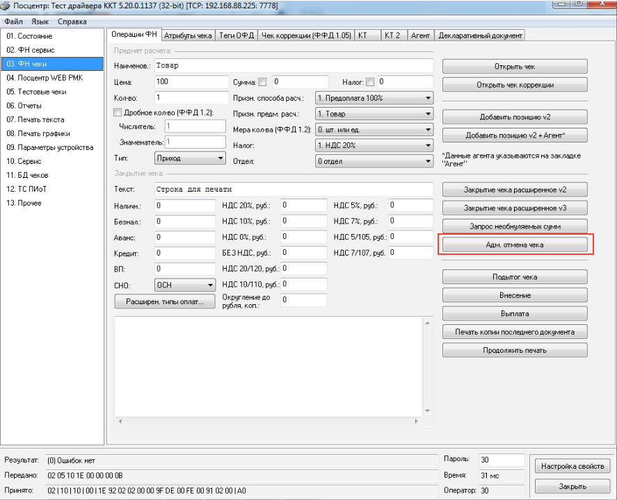

# Ошибка выполнения команды «Пробить чек» 22005

## Проблема

Касса выдаёт ошибку и пищит, перезагрузка не помогает. Текст ошибки:

> «ФР: Ошибка выполнения команды "ПробитьЧек"  
> КодОшибки: 22 005  
> Описание: Ошибка реализации команды <ПробитьЧек> в 1С-обработчике устройства  
> Текст ошибки:  
> {Обработка.ТорговоеОборудование.Форма.ФР_Штрих_ДрайверФР.Форма(1795)}:  
> Индекс находится за границами массива»

## Причина

Сотрудник поменял кассовую ленту, но не допечатал чек — в кассе остался незакрытый документ.

## Решение

Зайдите в тест драйвера → **«ФН чеки»** → **«Адм. отмена чека»**. После этого касса работает штатно.

## См. также

- [Закончилась кассовая лента](../Закончилась%20кассовая%20лента/zakonchilas-kassovaya-lenta.md)

## Похожие вопросы

- Ошибка выполнения команды «Пробить чек» 22005
- Касса пищит и не пробивает чек
- Индекс находится за границами массива при пробитии чека
- Поменяли ленту — касса перестала печатать чеки
- Как отменить зависший чек в кассе

## Теги

касса, ККМ, чек, пробить чек, ошибка 22005, кассовая лента, адм. отмена чека, тест драйвера ККТ
