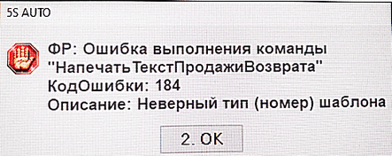

# Ошибка при возврате

**Источник:** https://www.5systems.ru/help/reshenie-rasprostranennykh-oshibok-pri-rabote-s-kassoy

## Проблема

При оформлении возврата выходит ошибка.

## Причина

Установленная версия драйвера ККТ не поддерживает корректную работу с возвратом.

## Решение

Рекомендуется откат драйвера ККТ на предыдущую версию.

## Похожие вопросы

- Ошибка при возврате
- Не оформляется возврат на кассе
- Неверный тип шаблона при печати возврата
- Касса перестала делать возвраты после обновления драйвера
- Как откатить драйвер ККТ на предыдущую версию

## Теги

касса, ККМ, возврат, драйвер ККТ, откат драйвера
