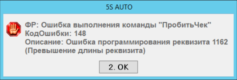

# Ошибка при печати чека с маркировкой

<table><tr><td><b>Обновлено:</b> 24.08.2026</td></tr></table>

Источник: https://www.5systems.ru/help/reshenie-rasprostranennykh-oshibok-pri-rabote-s-kassoy

## Проблема

При печати чека с маркированным товаром выходит ошибка.

## Причина

Длина кода маркировки больше допустимой по количеству символов.

## Решение

Проверьте корректность кода маркировки: его длина не должна превышать допустимое количество символов.

## Похожие вопросы

- Ошибка при печати чека с маркировкой
- Превышение длины реквизита при пробитии чека
- Не пробивается чек с маркированным товаром
- Касса ругается на код маркировки
- Что делать, если код маркировки слишком длинный

## Теги

Торговое оборудование, касса, ККМ, маркировка, код маркировки, длина кода, печать чека
