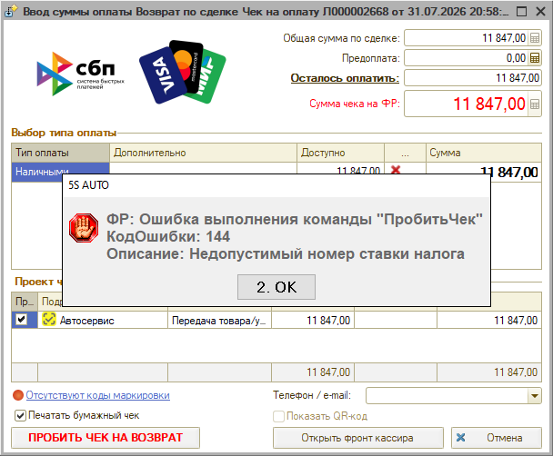

# Ошибка при пробитии чека 144 – недопустимый номер ставки налога

## Проблема

При пробитии чека выходит ошибка кассы:

> ФР: Ошибка выполнения команды "ПробитьЧек"  
> КодОшибки: 144  
> Описание: Недопустимый номер ставки налога

## Причина

Настройки налоговых ставок в программе не соответствуют настройкам в тест-драйвере кассы: ставка, указанная в чеке, драйверу неизвестна. Например, в чеке есть ставка НДС 22 %, а в тест-драйвере такой ставки нет.

## Решение

1. Проверьте ставки НДС в документе продажи — они должны соответствовать вашей системе налогообложения.
2. Если ставка указана неверно, проверьте настройки ставок НДС и налоговых групп в программе.
3. Убедитесь, что установлена актуальная версия тест-драйвера.

Если ставки в документе указаны верно, а ошибка повторяется, значит в драйвере отсутствует эта ставка. Обратитесь к вашему системному администратору, чтобы драйвер обновили для работы с новыми ставками НДС (например, 22 %).

## Рекомендуем для изучения

- Статья [Подключение кассы ККМ](https://www.5systems.ru/help/podklyuchenie-kassy-kkm#stavki_nds), раздел «Ставки НДС и Налоговые группы»

**Теги:** касса, ККМ, чек, ошибка 144, НДС, ставка налога, тест-драйвер, налоговые группы
