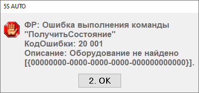
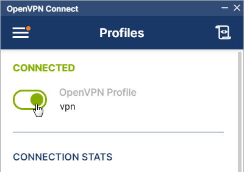

<a id="top"></a>

# Ошибки включения кассы

**Источник:** https://www.5systems.ru/help/deystviya-v-sluchae-esli-kassa-ne-rabotaet

## Содержание

- [Ошибки включения кассы](#ошибки-включения-кассы-1)
  - [1. Нет связи](#1-нет-связи)
  - [2. Фискальный регистратор не установлен](#2-фискальный-регистратор-не-установлен)
  - [3. Оборудование не найдено](#3-оборудование-не-найдено)
- [Решение](#решение)
- [Сетевая касса](#сетевая-касса)
- [Несетевая касса](#несетевая-касса)

## Ошибки включения кассы

При проблемах с подключением кассы программа последовательно выдаёт следующие три сообщения об ошибке.

### 1. Нет связи

> Фискальный регистратор  
> КодОшибки: 2  
> Описание: Нет связи


или

> ФР: Ошибка выполнения команды "ПробитьЧек"  
> КодОшибки: -1  
> Описание: Нет связи


### 2. Фискальный регистратор не установлен

Следом за ошибкой «Нет связи» выходит ошибка следующего вида:

> Фискальный регистратор не установлен.  
> Начало смены выполнено быть не может


или

> Фискальный регистратор не установлен.  
> X-отчёт снять быть не может


### 3. Оборудование не найдено

Затем выходит следующая ошибка:

> ФР: Ошибка выполнения команды "Получить состояние"  
> КодОшибки: 20 001  
> Описание: Оборудование не найдено



Все приведённые ошибки означают, что касса не работает, не доступна в 1С либо нет связи с кассой.

## Решение

При появлении подобных ошибок выполните следующие действия.

**Шаг 1.** Выключите и включите кассу.

Первое, что стоит сделать, — перезапустить кассу и перезайти в 1С:

Выключить 1С → Выключить кассу → Перезагрузить роутер → Дождаться включения → Включить кассу → Включить 1С.

**Шаг 2.** Проверьте подключение USB-кабеля, соединяющего компьютер и кассу (в случае подключения кассы данным способом).

**Шаг 3.** Перезагрузите компьютер, к которому подключена касса.

**Шаг 4.** Если для работы с кассой используется программа VSPE, проверьте, запущена ли данная программа:


Подробнее см. в [статье](https://5systems.ru/help/podklyuchenie-kassy-kkm#dostup_cherez_progr).

Для программы VSPE настраивается автоматический запуск при включении компьютера. При возникновении ошибки запуска, если касса выключена, следует закрыть окно приложения и открыть заново через иконку на рабочем столе. Также проверить кабель, соединяющий кассу с компьютером.

Если в окне приложения касса отображается красным цветом и с надписью «failed» — значит, данная касса не подключена. Можно проверить порты через **Диспетчер устройств → Порты**: если нужный порт не отображается, значит, проблема с подключением.

Номер порта может измениться, например, если переподключить кабель в другой USB-порт на компьютере.

**Шаг 5.** Если для работы с кассой на компьютер установлен VPN (см. в [статье](https://5systems.ru/help/podklyuchenie-kassy-kkm#dostup_cherez_progr)), проверьте, подключена ли данная программа:


Для программы VPN также настраивается автоматический запуск при включении компьютера. Если VPN не запущен, то нужно запустить его вручную — открыть окно программы и перетащить ползунок:



## Сетевая касса

Если касса сетевая, то нужно смотреть на то, как именно она подключена в 1С.

### Вариант 1. Касса подключена к компьютеру

Скорее всего, используется сторонняя программа, которая позволяет пробросить COM-порт в Ethernet. Доступность кассы в этом случае зависит от:

- брандмауэра ПК, к которому подключена касса, и любых программ, которые могут блокировать внешние подключения;
- VPN между сервером и локальной сетью РК;
- занятости кассы другими пользователями (например, открытый фронт кассира);
- плохого или отсутствующего интернет-соединения.

Помочь в этом случае может:

1. **Проверка, включена ли сторонняя программа**, которая пробрасывает доступ в Ethernet. Часто используется VSPE: проверить можно, посмотрев в трей Windows — там должна быть иконка VSPE.
2. **Проверка, верный ли указан порт** в сторонней программе.
   - Если подключение сделано через VPN, то обычно достаточно посмотреть в оборудовании 1С порт и сравнить с тем, что в VSPE.
   - Если подключение сделано через проброс порта, это может стать довольно сложной задачей.
3. **Проверка занятости кассы другими сотрудниками.** Это можно сделать несколькими способами:
   - *Первый.* Если мы подключены к компьютеру, где касса, — посмотреть в VSPE статус: если `OK`, то касса занята; если `Ready` — не занята.
   - *Второй.* Проверить все соединения на сервере. Смотрим IP-адрес кассы и порт и выполняем следующую команду:

     ```
     netstat -aon | findstr "ПОРТ"
     ```

     Вместо `ПОРТ` подставить порт кассы. Выведет список из всех связанных с этим портом соединений: смотрим на те, которые связаны с IP кассы. Если таких нет — значит, соединений нет.
4. **Проверка доступности адреса с сервера** с помощью командной строки, теста драйвера кассы. Если касса из-под сервера доступна и не включается, то, возможно, её кто-то занял. Если включается периодически (попробовали 10 раз включить, из них включилась три раза), то похоже на потерю пакетов (плохое соединение). Если вообще недоступна, то нужно смотреть, запущено ли VSPE; если не запущено — нужно смотреть, есть ли VPN или роутер.
5. **Настройка временного VPN-соединения** между сервером и ПК, к которому подключена касса.
6. **Перезагрузка кассы.** Отключение от ПК и подключение через 2 минуты.

### Вариант 2. Касса подключена прямо в сеть

Причин может быть много: почти всё вышеописанное, плюс необходимость проверки на роутере.

## Несетевая касса

Если касса не сетевая, то пользоваться ей может только один пользователь. Необходимые действия для проверки:

1. Убедиться, что номер порта на ПК, к которому подключена касса, соответствует номеру порта в 1С.
2. Отключиться от сервера, подключиться заново. Важно правильно отключаться:
   - если RemoteApp, то в 1С **Файл → Открыть**, в окошке в адресной строке написать `logoff`;
   - если «Подключение к удалённому рабочему столу», то через **Пуск → Пользователь → Выход** (или как для RemoteApp).

---

**Теги:** касса, ККМ, нет связи, фискальный регистратор, оборудование не найдено, VSPE, VPN, сетевая касса, включение кассы

<a href="#top"></a>
