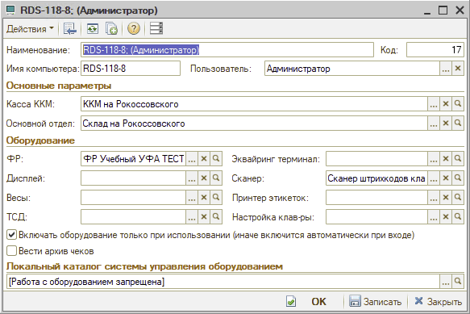

# Работа с оборудованием запрещена

**Источник:** https://www.5systems.ru/help/reshenie-rasprostranennykh-oshibok-pri-rabote-s-kassoy

## Проблема

Ошибка «Работа с оборудованием запрещена» может возникнуть при работе с любым оборудованием.


Пример:



## Причина

В рабочем месте пользователя не указана «рабочая» папка оборудования.

## Решение

Для того чтобы оборудование заработало, требуется указать адрес «рабочей папки» в своём рабочем месте:

```
C:\ProgramData\Protect\LocalProtect\
```


После этого перезайти в систему.

## См. также

- [Оборудование не найдено](../Оборудование%20не%20найдено/oborudovanie-ne-naydeno.md)

## Похожие вопросы

- Работа с оборудованием запрещена
- Не работает оборудование у пользователя
- Где указать рабочую папку оборудования
- Ошибка при подключении сканера или кассы
- Что прописать в рабочем месте пользователя для оборудования

## Теги

касса, ККМ, оборудование, рабочая папка, рабочее место пользователя, LocalProtect
