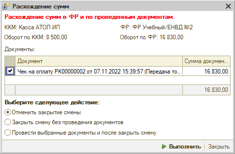
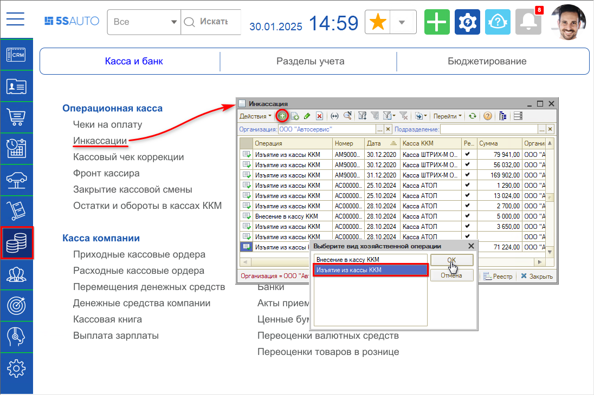
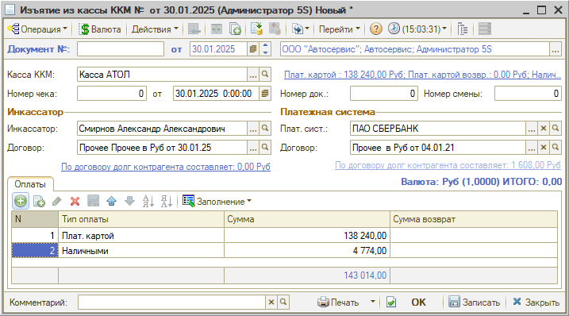

# Расхождение сумм

<table><tr><td><b>Обновлено:</b> 24.08.2026</td></tr></table>

Источник: https://www.5systems.ru/help/reshenie-rasprostranennykh-oshibok-pri-rabote-s-kassoy

## Проблема

При закрытии смены в кассе ККМ и на ФР обнаруживаются разные суммы — открывается окно «Расхождение сумм». Выводятся данные «Оборот по ККМ» и «Оборот по ФР». Программа, как правило, находит в базе чек на сумму расхождения и выводит его в таблице «Документы»:

## Причина

Расхождение возникает, когда по чекам в 1С и по пробитым чекам на ФР есть разница. Причин может быть несколько:

1. **Чек был изменён кем-то из сотрудников.**
2. **Пробили чек по постоплате.**
3. **Чек был помечен на удаление:**
   - например, сотрудник перепутал нал и безнал, и вместо того чтобы сделать возврат, пробил чек заново, а первый чек пометил на удаление;
   - если произошёл кассовый сбой: данные ушли в ОФД, а программа посчитала, что чек не пробит, и пометила его на удаление. Определить, что чек был помечен на удаление, можно по нумерации (будет пропущен один номер).

## Решение

### Способ 1. Найти разницу и попытаться исправить ситуацию

1. **Чек был изменён** — сравните все данные с тем, что ушло в ОФД, и по возможности исправьте в программе.
2. **Чек пробит по постоплате** — сделайте возврат и пробейте правильно.
3. **Чек помечен на удаление** — найдите нужный чек по реквизитам и проведите, но только если уверены, что чек точно пробился на ФР.

### Способ 2. Инкассировать все остатки по кассе

Для того чтобы закрыть смену, следует выполнить следующие действия:

1. Сформировать Z-отчёт:

   

2. Нажать на фронте кассира кнопку «Изъятие» — в программе будет создан документ «Инкассация». Следует перейти в созданный документ и дозаполнить его по всем типам оплаты — можно использовать автозаполнение по кнопке «Заполнить остатками по кассе ККМ».

   Либо (например, если сумма «0») создать документ «Инкассация» вручную:

   

   И заполнить остатками:

   

   Документ должен быть заполнен всей суммой, которую выдаст программа, по всем типам оплаты:

   

3. Оформить ПКО на основании созданной инкассации для учёта в системе суммы, снятой наличными (подробнее см. урок «Учёт кассовой выручки»).

### Способ 3. Закрыть смену не выбирая кассу ККМ

Если критично закрыть смену прямо сейчас, можно просто закрыть смену не выбирая кассу ККМ. В этом случае проверка происходить не будет.

Также см. статью «Закрытие кассовой смены» и урок «Как закрыть смену».

## Похожие вопросы

- Расхождение сумм
- При закрытии смены не сходятся суммы по ККМ и ФР
- Оборот по ФР больше, чем в программе
- Как закрыть смену, если есть расхождение
- Почему в базе пропущен номер чека

## Теги

Торговое оборудование, касса, ККМ, расхождение сумм, закрытие смены, оборот по ФР, Z-отчет, инкассация, изъятие, ОФД
