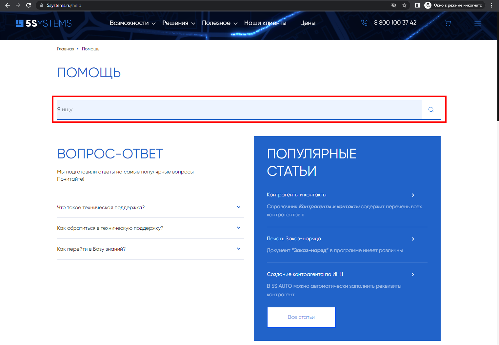

# Как быстро найти нужную статью на Базе знаний

**Источник:** https://www.5systems.ru/help (раздел «Вопрос-ответ»)

## Вопрос

Как быстро найти нужную статью на Базе знаний?

## Ответ

Статьи на Базе знаний разбиты по тематическим разделам, по которым удобно ориентироваться.

Если вы не нашли нужную статью в разделах, а также для поиска дополнительных материалов можно воспользоваться полнотекстовым поиском на странице [«Помощь»](https://www.5systems.ru/help):

Введите искомое слово или фразу и нажмите на лупу либо на клавишу Enter:

Будут выведены все материалы Базы знаний, содержащие искомый запрос.

## См. также

- [Как перейти в Базу знаний](../Как%20перейти%20в%20Базу%20знаний/kak-pereyti-v-bazu-znaniy.md)

## Похожие вопросы

- Как быстро найти нужную статью на Базе знаний
- Есть ли поиск по статьям
- Не могу найти инструкцию по нужной теме
- Как искать материалы на сайте 5SYSTEMS
- Где находится строка поиска по Базе знаний

## Теги

база знаний, поиск, полнотекстовый поиск, статьи
