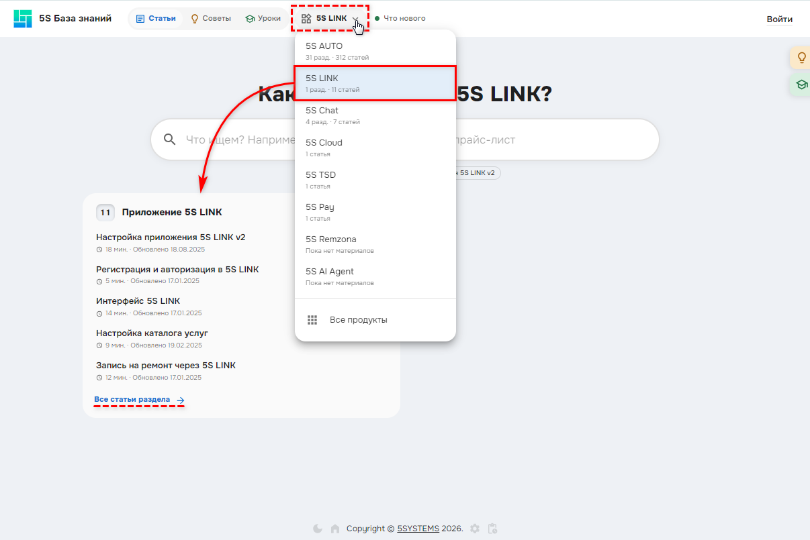
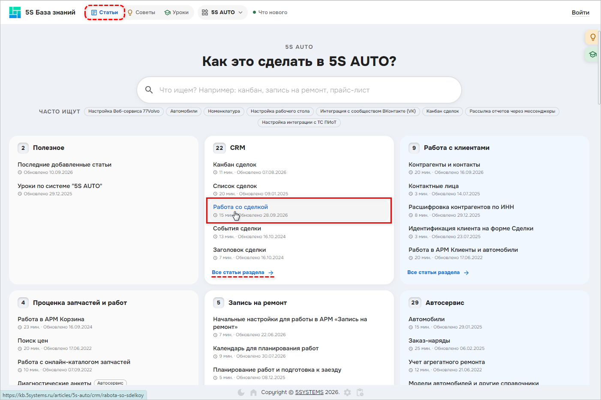
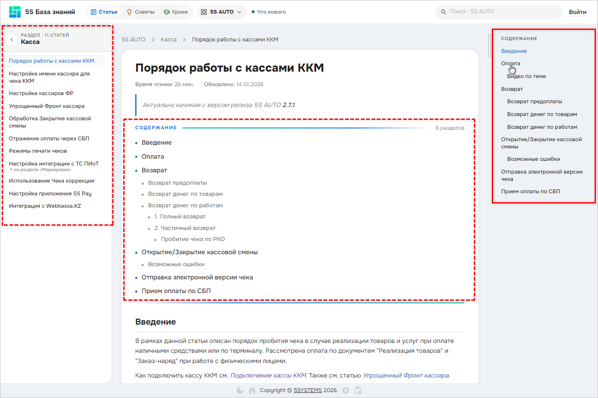
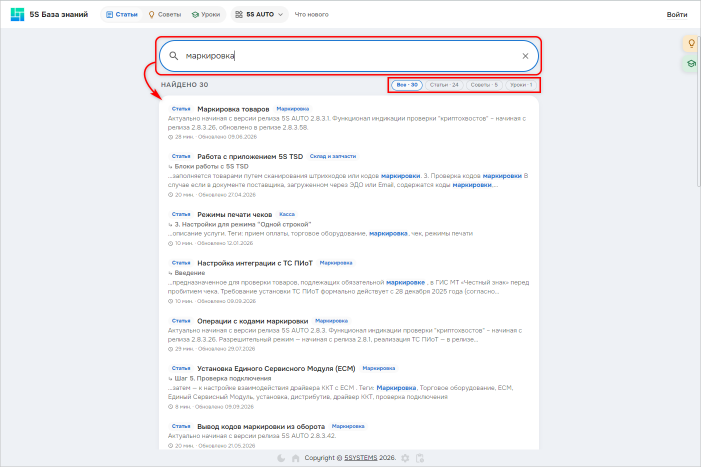
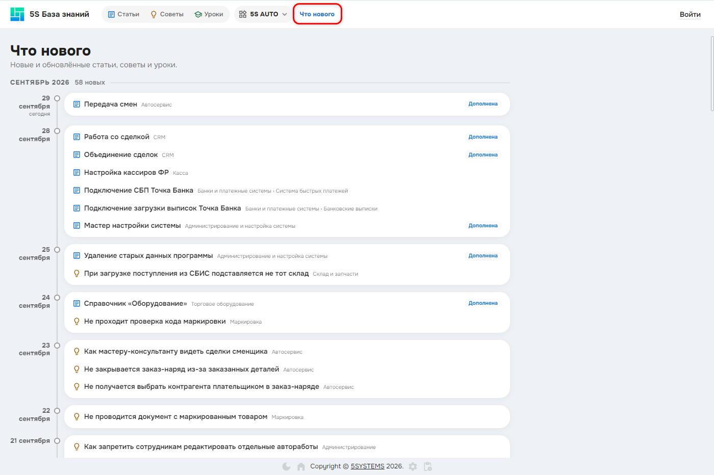

# Как быстро найти нужную статью на Базе знаний

<table><tr><td><b>Обновлено:</b> 28.09.2026</td></tr></table>

Источник: https://www.5systems.ru/help (раздел «Вопрос-ответ»)

## Вопрос

Как быстро найти нужную статью на Базе знаний?

## Ответ

1. Выберите нужный продукт на главной странице [Базы знаний](https://kb.5systems.ru) или в шапке сайта — тогда в разделах останутся только материалы по нему (подробнее см. совет «[Как перейти в Базу знаний](../Как%20перейти%20в%20Базу%20знаний/kak-pereyti-v-bazu-znaniy.md)»).

   

2. Если тема известна, найдите статью ***по разделам.*** На странице продукта материалы сгруппированы по разделам: у каждого раздела указано число статей, а у статей — время чтения и дата обновления. Откройте нужную статью или нажмите *«Все статьи раздела»*. Справа на странице – кнопки быстрого перехода к ***советам*** и ***урокам:***

   

   Внутри статьи слева отображается список статей того же раздела, а вверху — путь к статье. Перейти к нужной части статьи можно через ***«Содержание»***:

   

3. Воспользуйтесь ***поиском*** на главной странице или в шапке сайта — поиск идет по всей Базе знаний (независимо от выбранного продукта).

   Результаты появляются сразу во время ввода. Их можно отфильтровать: *Все, Статьи, Советы, Уроки* — рядом с каждым фильтром указано число найденных материалов. У каждого результата видно, в каком разделе лежит материал, в какой части статьи и в каком фрагменте текста найден запрос:

   

> [!TIP]
> Если по продукту немного материалов (например, 5S LINK или 5S Pay), нужную статью удобно найти по разделам. По 5S AUTO материалов много — здесь быстрее воспользоваться поиском.

Новые и обновленные материалы собраны в разделе ***«Что нового»*** в шапке сайта. Материалы сгруппированы по датам, у обновленных статей стоит отметка *«Дополнена»:*

## См. также

- [Как перейти в Базу знаний](../Как%20перейти%20в%20Базу%20знаний/kak-pereyti-v-bazu-znaniy.md)

## Похожие вопросы

- Как быстро найти нужную статью на Базе знаний
- Есть ли поиск по статьям
- Не могу найти инструкцию по нужной теме
- Как искать материалы на сайте 5SYSTEMS
- Где находится строка поиска по Базе знаний

## Теги

база знаний, поиск, статьи, советы, уроки, что нового
