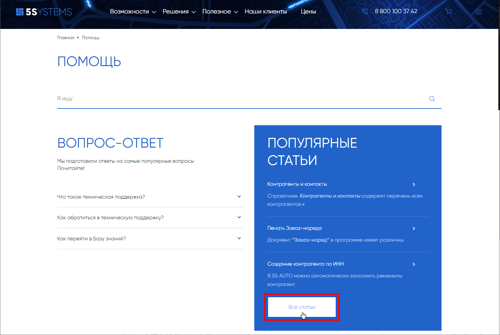
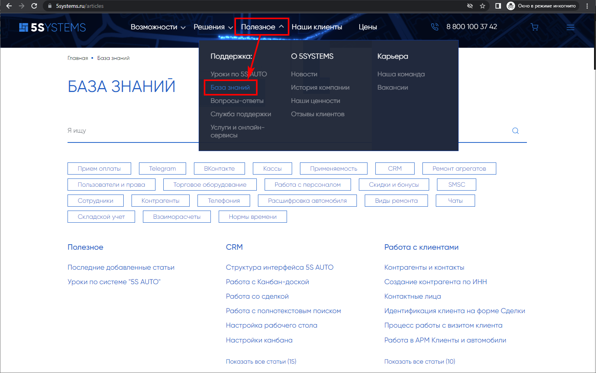

# Как перейти в Базу знаний

**Обновлено:** 24.08.2026

Источник: https://www.5systems.ru/help (раздел «Вопрос-ответ»)

## Вопрос

Как перейти в Базу знаний с сайта 5SYSTEMS?

## Ответ

Для того чтобы перейти в [Базу знаний](https://www.5systems.ru/articles), нажмите кнопку «Все статьи» внизу блока «Популярные статьи» на странице [«Помощь»](https://www.5systems.ru/help):

Также быстро перейти в Базу знаний можно через верхнее меню сайта *«Полезное → Поддержка → База знаний»*:

Ссылка на Базу знаний: https://www.5systems.ru/articles

## См. также

- [Как быстро найти нужную статью на Базе знаний](../Как%20быстро%20найти%20нужную%20статью%20на%20Базе%20знаний/kak-bystro-nayti-nuzhnuyu-statyu-na-baze-znaniy.md)

## Похожие вопросы

- Как перейти в Базу знаний
- Где находятся все статьи 5SYSTEMS
- Дайте ссылку на Базу знаний
- Как открыть инструкции по программе с сайта
- В каком разделе сайта лежат статьи

## Теги

база знаний, статьи, навигация по сайту
