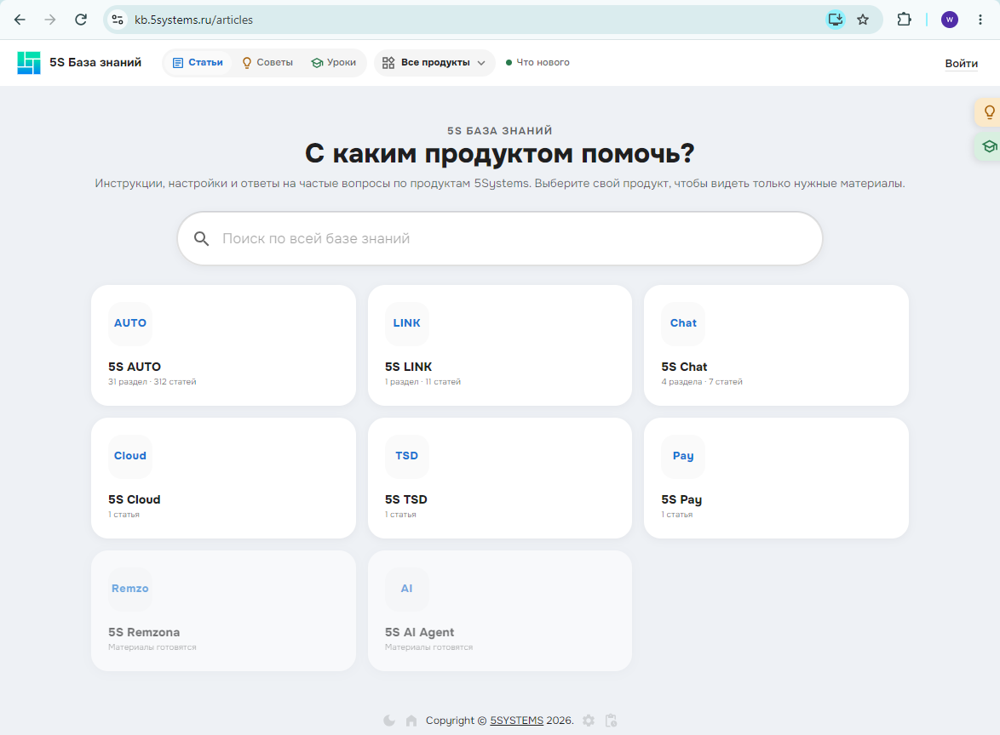
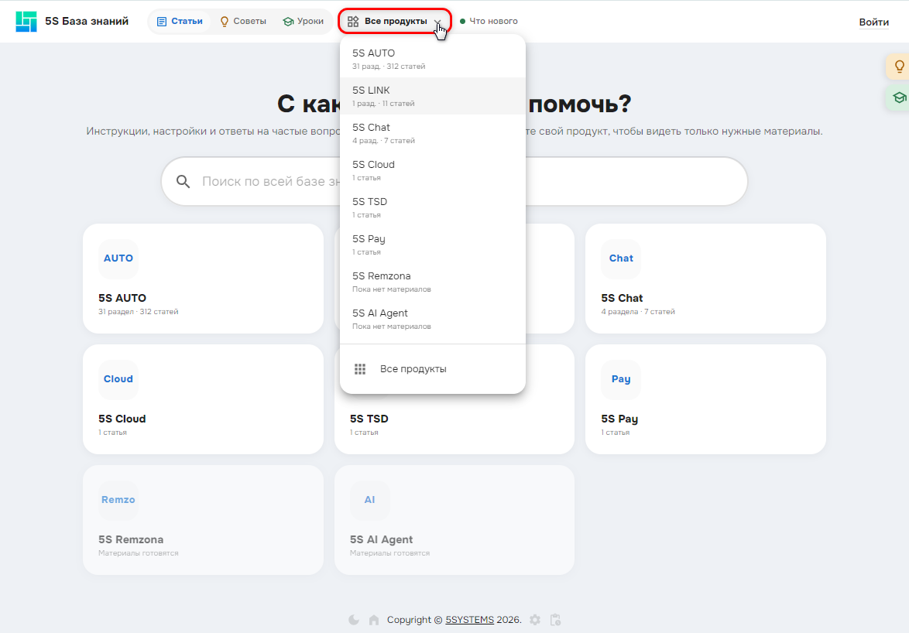
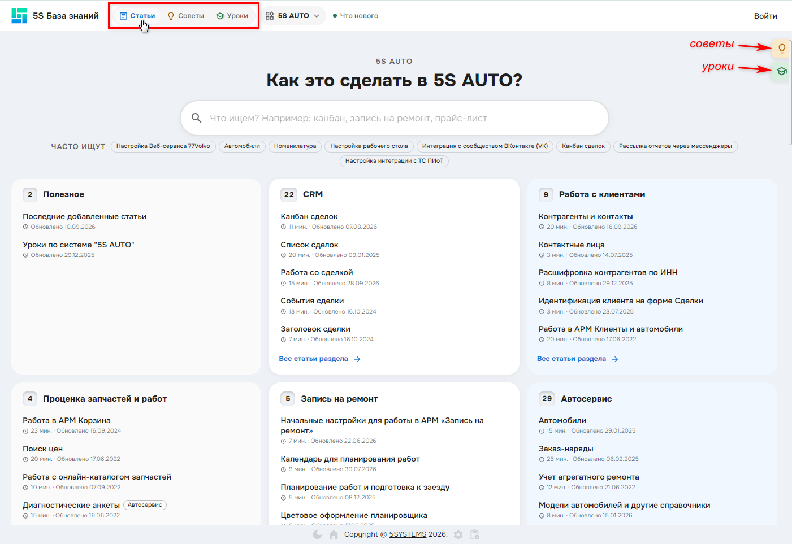
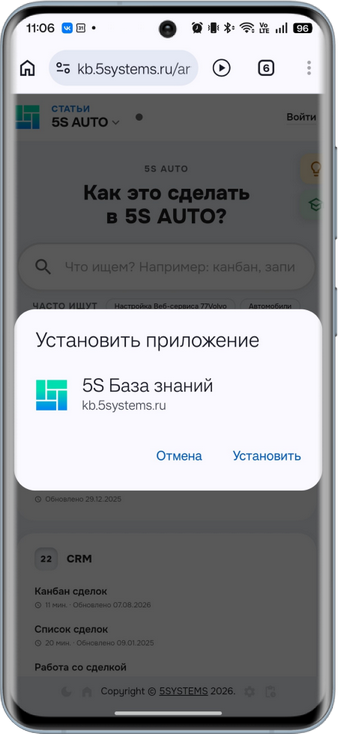
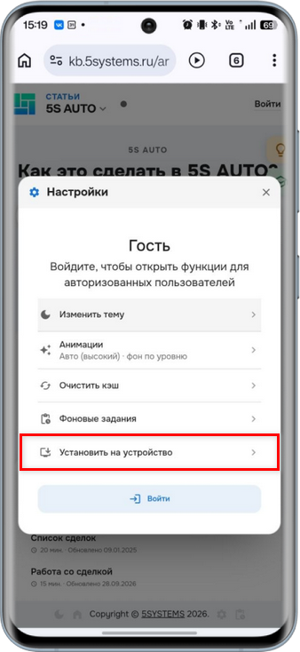

# Как перейти в Базу знаний

<table><tr><td><b>Создано:</b> 30.09.2026</td></tr></table>

## Вопрос

Как перейти в Базу знаний?

## Ответ

База знаний 5SYSTEMS находится по адресу [kb.5systems.ru](https://kb.5systems.ru) — откройте его в любом браузере, в том числе на телефоне.

На главной странице выберите свой продукт, например *5S AUTO* или *5S LINK*. После этого в разделах будут видны только материалы по выбранному продукту:

Сменить продукт можно в любой момент в шапке сайта:

Материалы Базы знаний собраны на трех вкладках:

- ***Статьи*** — подробные инструкции по настройке и работе в программе;
- ***Советы*** — короткие ответы на частые вопросы и решения типовых проблем;
- ***Уроки*** — пошаговые учебные курсы.

Перейти к советам и урокам также можно кнопками справа на странице:

### Мобильная версия и приложение

База знаний адаптирована под мобильные устройства: на телефоне и планшете страницы подстраиваются под размер экрана:

 &nbsp;&nbsp;&nbsp;&nbsp;&nbsp;&nbsp; 

> [!TIP]
> Чтобы переключить ***светлую или темную тему,*** нажмите значок луны / солнца внизу страницы или *«Настройки → Изменить тему»*.

Базу знаний можно установить на компьютер или телефон как ***отдельное приложение*** — она будет открываться в своем окне, без адресной строки браузера:

- в браузерах, которые поддерживают установку приложений (например, Google Chrome, Microsoft Edge), нажмите значок настроек внизу страницы и выберите ***«Установить на устройство»***;
- на iPhone и iPad откройте Базу знаний в Safari, нажмите *«Поделиться»* и выберите *«На экран «Домой»»*.

При первом открытии Базы знаний на компьютере или телефоне на несколько секунд появляется предложение установить приложение — нажмите ***«Установить»*** и подтвердите установку:

 &nbsp;&nbsp;&nbsp;&nbsp;&nbsp;&nbsp; 

Если предложение закрылось, установить приложение можно через меню настроек (пункт *«Установить на устройство»*):

Также можно просто добавить адрес [kb.5systems.ru](https://kb.5systems.ru) в закладки браузера.

## См. также

- [Как быстро найти нужную статью на Базе знаний](../Как%20быстро%20найти%20нужную%20статью%20на%20Базе%20знаний/kak-bystro-nayti-nuzhnuyu-statyu-na-baze-znaniy.md)

## Похожие вопросы

- Как перейти в Базу знаний
- Где находятся все статьи 5SYSTEMS
- Дайте ссылку на Базу знаний
- Как открыть инструкции по программе с сайта
- В каком разделе сайта лежат статьи

## Теги

база знаний, kb.5systems.ru, статьи, советы, уроки, навигация
