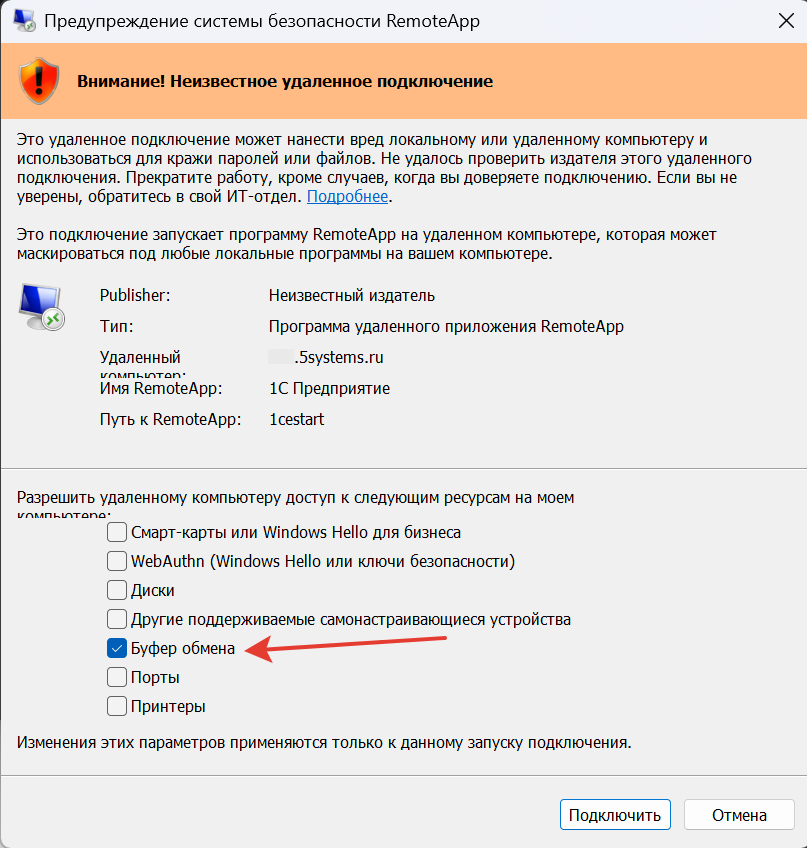

# Не копируются данные из 1С и наоборот (буфер обмена всегда пуст)

## Проблема

Не работают сочетания клавиш Ctrl+C и Ctrl+V: данные не копируются ни из 1С, ни в обратную сторону, буфер обмена всегда пуст. Например, не удается скопировать пароль от почтового ящика, чтобы указать его в настройках почтовой программы для загрузки накладных.

## Причина

После одного из обновлений Windows при подключении через RemoteApp стало запрашиваться разрешение на доступ к ресурсам вашего компьютера — в том числе к буферу обмена. Если доступ к буферу обмена не разрешен, копирование между локальным компьютером и программой не работает.

## Решение

При запуске подключения в окне **«Предупреждение системы безопасности RemoteApp»** отметьте галочкой **«Буфер обмена»** и нажмите **«Подключить»**.

Обратите внимание на подпись внизу окна: изменения этих параметров применяются только к данному запуску подключения. То есть отмечать галочку нужно при каждом подключении.

*Примечание:* остальные галочки в этом окне тоже рекомендуется проставить — в частности, **«Принтеры»** и **«Порты»**, иначе программа не найдет подключенное к вашему компьютеру оборудование.

## Похожие вопросы

- Не копируются данные из 1С и наоборот
- Не работает ctrl+c/ctrl+v, например не могу скопировать пароль для доступа почтовой программы в мой почтовый аккаунт (для загрузки накладных)

## Теги

буфер обмена, копирование, вставка, Ctrl+C, Ctrl+V, RemoteApp, принтеры, порты, доступ к ресурсам
