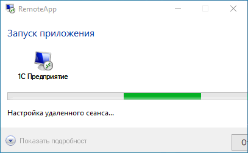

# Не получается подключиться к облаку

**Источник:** https://www.5systems.ru/help (раздел «Вопрос-ответ»)

Если при открытии ярлыка [приложения](https://www.5systems.ru/help/kak-zayti-v-programmu#cherez_prilozh) запуск программы не происходит в течение нескольких минут либо окно запуска сеанса не открывается, выполните следующие действия.

**Шаг 1.** Отключитесь от сервера, подождите 3 минуты и повторите попытку подключения.

**Шаг 2.** Если проблема осталась, подключитесь к программе [через удалённый рабочий стол](https://www.5systems.ru/help/kak-zayti-v-programmu#udal_rab_stol). На удалённом рабочем столе должна быть открыта 1С — [закройте её](https://www.5systems.ru/help/kak-zayti-v-programmu#zaversh_rab) и повторите обычную попытку подключения через приложение RemoteApp.

## См. также

- [Как обратиться в техническую поддержку](../Как%20обратиться%20в%20техническую%20поддержку/kak-obratitsya-v-tekhnicheskuyu-podderzhku.md)
- [Что делать в аварийной ситуации](../Что%20делать%20в%20аварийной%20ситуации/chto-delat-v-avariynoy-situacii.md)

**Теги:** облако, RemoteApp, подключение, удаленный рабочий стол, запуск программы
