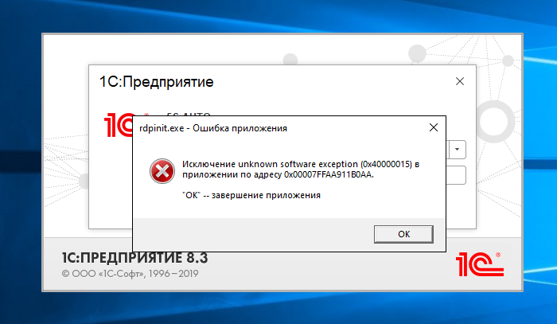

# Проблема с подключением к серверу — ошибка приложения

## Проблема

Программа неожиданно закрывается («выкидывает» из программы), а при повторном входе выходит ошибка приложения:

> rdpinit.exe — Ошибка приложения  
> Исключение unknown software exception (0x40000015) в приложении по адресу <...>.  
> "OK" -- завершение приложения

Незадолго до этого могут появиться другие признаки — например, из программы перестает печатать принтер.

*Примечание:* код 0x40000015 (STATUS_FATAL_APP_EXIT) означает, что приложение завершило работу по собственной инициативе — не смогло запуститься. На причину сбоя сам код не указывает, ее определяют по журналу событий на сервере.

## Причина

Проблема на стороне сервера: вероятнее всего, на его диске закончилось свободное место.

> *Комментарий: уточнить, как сформулировать эту проблему для клиентов и будет ли отдельный раздел для внутреннего пользования, куда можно будет выкладывать подобные задачи.*

## Решение

Самостоятельно решить проблему нельзя — обратитесь к сотрудникам технической поддержки 5SYSTEMS.

## См. также

- [Как обратиться в техническую поддержку](../Как%20обратиться%20в%20техническую%20поддержку/kak-obratitsya-v-tekhnicheskuyu-podderzhku.md)
- [Что делать в аварийной ситуации](../Что%20делать%20в%20аварийной%20ситуации/chto-delat-v-avariynoy-situacii.md)

## Похожие вопросы

- Проблема с подключением к серверу — ошибка приложения
- Выкинуло с программы. при входе - ошибка. Перед этим перестал печатать принтер с программы

## Теги

сервер, подключение, ошибка приложения, rdpinit.exe, unknown software exception, не печатает принтер, место на диске, техподдержка
